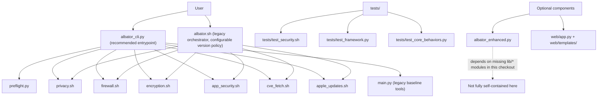

# Albator


Albator is a macOS hardening toolkit that combines shell-based security scripts with Python wrappers for preflight checks, legacy baseline generation, and test automation.

## Current Scope

- Core hardening scripts: `privacy.sh`, `firewall.sh`, `encryption.sh`, `app_security.sh`
- Security intelligence scripts: `cve_fetch.sh`, `apple_updates.sh`
- Legacy orchestrator: `albator.sh` (now enforces configurable min macOS policy from `config/albator.yaml`)
- Unified Python CLI: `albator_cli.py` with preflight and script passthrough
- Validation assets: `tests/test_security.sh`, `tests/test_framework.py`, `tests/test_core_behaviors.py`

## Version Notes

- The legacy entrypoint `albator.sh` now reads `preflight.min_macos_version` and `preflight.enforce_min_version`.
- Current preflight policy defaults to a minimum macOS version of `26.3` via config and test defaults.
- If you use modern flows, run `albator_cli.py preflight` first and follow its output.

## Requirements

- macOS with administrator privileges (`sudo`)
- Python 3.8+
- `curl` and `jq` (required for CVE/update fetch workflows)
- `pup` (optional, used by update parsing when available)

Install Python dependencies:

```bash
pip3 install -r requirements.txt
```

## Quick Start

Run preflight checks:

```bash
python3 albator_cli.py preflight --json
python3 albator_cli.py doctor
python3 albator_cli.py --json-output doctor
```

Run individual hardening scripts through the unified CLI:

```bash
python3 albator_cli.py privacy
python3 albator_cli.py firewall
python3 albator_cli.py encryption
python3 albator_cli.py app_security
python3 albator_cli.py --json-output privacy --dry-run
```

Run threat intelligence helpers:

```bash
python3 albator_cli.py cve_fetch --dry-run
python3 albator_cli.py apple_updates --offline --verbose
```

## Legacy Entrypoint

The Bash orchestrator remains available:

```bash
./albator.sh --firewall --privacy --report --test
```

Use this path only if you explicitly want the legacy orchestration flow.

## Testing and Validation

Shell validation suite:

```bash
./tests/test_security.sh --verbose
```

Python integration-style checks:

```bash
python3 tests/test_framework.py --verbose --include-mutating
python3 tests/test_framework.py --verbose --include-privileged
```

Core unit tests:

```bash
python3 -m unittest tests/test_core_behaviors.py -v
```

For the full validation matrix, see `VALIDATION_AND_TESTING.md`.

## Configuration

Primary runtime config:

- `config/albator.yaml`

macOS 26.3 profile pack:

- `config/profiles/macos_26_3.yaml`
- `config/profiles/core_only.yaml` (minimal supported release boundary)

Relevant preflight keys in `config/albator.yaml`:

- `preflight.min_macos_version`
- `preflight.enforce_min_version`

## GitHub Releases (Binaries + Source)

Albator now includes automated tag-based release publishing with macOS Swift binaries.

When a tag matching `v*` is pushed (example: `v3.0.2`), workflow `.github/workflows/release-artifacts.yml` builds and publishes:
- `albator-swift-vX.Y.Z-macos-arm64.tar.gz`
- `*.sha256` checksum files for each artifact
- source archive `albator-vX.Y.Z.tar.gz` + checksum

Publish a release:

```bash
git tag v3.0.2
git push origin v3.0.2
```

For Swift-specific details, see `albator-swift/README.md`.

## Architecture Overview



## Notes and Limitations

- Some actions require reboot or user interaction (for example FileVault workflows).
- `apple_updates.sh --offline` now degrades gracefully when cache is missing.
- Set `STRICT_OFFLINE=true` if you want offline mode to fail when no cache exists.
- `tests/test_security.sh` minimum version is configurable with `MIN_MACOS_VERSION` (default `26.3`).
- Script fixes are protected against shell injection by rejecting shell control characters.
- Core hardening scripts return explicit status codes: `0` (applied/success), `10` (already compliant/no-op), `1` (error).
- Set `ALBATOR_LOG_FORMAT=json` for structured shell-script log lines.
- Dry-run executions now generate plan artifacts in `${ALBATOR_STATE_DIR:-/tmp/albator_state}`.
- API endpoints in `web/app.py` require `X-Albator-Token` when `ALBATOR_API_TOKEN` is set.
- Set `ALBATOR_TEST_ALLOW_DRYRUN_NO_SUDO=true` to allow deterministic dry-run script validation without non-interactive sudo.

## Optional/Experimental Components

- `albator_enhanced.py` and `web/` are present, but some enhanced enterprise modules referenced by `albator_enhanced.py` are not included in this checkout (`lib/` imports). Treat that path as optional unless those modules are restored.

## Security and Project Docs

- Security policy and disclosure process: `SECURITY.md`
- Validation/testing reference: `VALIDATION_AND_TESTING.md`
- Core-vs-optional component map: `CORE_VS_OPTIONAL.md`
- Deprecation policy and migration notes: `DEPRECATIONS.md`
- Full implementation notes (2026-02-18 pass): `IMPLEMENTATION_NOTES_2026-02-18.md`
- Change history: `CHANGELOG.md`

## Contributing

Open an issue or pull request with a reproducible test case and expected behavior.

## License

MIT License.
