# Albator - macOS 15.5 Hardening Tool


A series of scripts to harden macOS 15.5 (Sequoia) for security and privacy, inspired by NIST guidelines. Suitable for power users and novices alike. This project evolved from the macOS Security Compliance Project, a Python-based tool, with the current focus on Bash scripts while preserving legacy features.

## Usage

Albator provides multiple interfaces for macOS hardening:

### 1. Main Script (Legacy Interface)
Run the main script with options to harden specific areas or fetch security advisories:

```bash
./albator.sh [options]
```

#### Options
- `-f, --firewall`: Enable and configure firewall
- `-p, --privacy`: Adjust privacy settings
- `-e, --encryption`: Enable encryption (FileVault)
- `-s, --app-security`: Enable Gatekeeper and verify Hardened Runtime
- `-c, --cve`: Fetch recent CVE advisories relevant to macOS
- `-a, --apple`: Fetch Apple security updates for macOS Sequoia 15.5
- `-r, --report`: Generate a security report
- `-n, --ansible`: Run the Ansible playbook to automate hardening
- `-t, --test`: Run automated security tests
- `-h, --help`: Display this help message

#### Example
```bash
./albator.sh --cve --apple --firewall --report --ansible --test
```

### 2. Enhanced Individual Scripts
Each hardening component now supports advanced options:

#### Privacy Configuration
```bash
# Apply privacy settings
./privacy.sh

# Dry run (show what would be done)
./privacy.sh --dry-run

# Get help
./privacy.sh --help
```

#### Firewall Configuration
```bash
# Configure firewall
./firewall.sh

# Dry run mode
./firewall.sh --dry-run

# Include functionality tests
./firewall.sh --test
```

### 3. Comprehensive Testing
```bash
# Run all security tests
./tests/test_security.sh

# Dry run (no script execution)
./tests/test_security.sh --dry-run

# Verbose output
./tests/test_security.sh --verbose

# Python-based testing framework
python3 tests/test_framework.py --verbose --include-scripts

# Core unit tests for CLI/rule handling/security helpers
python3 -m unittest tests/test_core_behaviors.py -v
```

GitHub Actions now runs the core behavior suite on every push and pull request via `.github/workflows/core-tests.yml`.

### 4. Configuration Management
```bash
# Edit main configuration
vim config/albator.yaml

# Use different security profiles:
# - basic: Essential security for general users
# - advanced: Enhanced security for power users  
# - enterprise: Maximum security for organizations
```

### 5. Rollback System
```bash
# List available rollback points
python3 lib/rollback.py --list

# Rollback to a specific point
python3 lib/rollback.py --rollback <rollback_id>

# Dry run rollback
python3 lib/rollback.py --rollback <rollback_id> --dry-run

# Clean up old rollback points
python3 lib/rollback.py --cleanup 5
```

### 6. Enhanced Unified CLI (Enterprise)
```bash
# Comprehensive hardening with profile-based execution
python3 albator_enhanced.py harden --profile enterprise --dry-run

# Generate security analytics dashboard
python3 albator_enhanced.py dashboard --days 30

# Manage security profiles
python3 albator_enhanced.py profile list
python3 albator_enhanced.py profile create custom_profile --security-level 85

# Fleet management and bulk operations
python3 albator_enhanced.py fleet list
python3 albator_enhanced.py fleet deploy --profile advanced

# Compliance scanning with multiple frameworks
python3 albator_enhanced.py compliance --framework nist_800_53 --format html

# Rollback management
python3 albator_enhanced.py rollback list
python3 albator_enhanced.py rollback create --description "Before major changes"

# Interactive shell mode
python3 albator_enhanced.py shell

# Batch operations from file
python3 albator_enhanced.py batch operations.txt

# Plugin management
python3 albator_enhanced.py plugin list
python3 albator_enhanced.py plugin enable security_scanner

# Setup bash auto-completion
python3 albator_enhanced.py setup-completion
```

### 7. Legacy Unified CLI (Advanced)
```bash
# Legacy Python tools
python3 albator_cli.py legacy list_tags
python3 albator_cli.py legacy interactive

# Individual hardening scripts
python3 albator_cli.py privacy
python3 albator_cli.py firewall
```

## Requirements
- macOS 15.5 (Sequoia)
- Administrator privileges (sudo access)
- `curl` and `jq` for fetching CVE advisories (`brew install jq`)
- `pup` for parsing Apple security updates (`brew install pup`, optional but recommended)
- Python 3.8+ for enhanced features
- Additional Python packages: `pip3 install -r requirements.txt`

## Features

### Core Security Features
- Modular scripts for targeted hardening (firewall, privacy, encryption, app security)
- NIST-inspired security standards
- Configures various privacy settings, including disabling telemetry, Siri analytics, Safari search suggestions, remote login, remote management, and mDNS multicast advertisements.
- Enables the Application Layer Firewall, blocks all incoming connections except those explicitly allowed, and enables stealth mode.
- Enables FileVault encryption, requiring user interaction to set up a recovery key.
- Enables Gatekeeper and verifies Hardened Runtime for applications.
- Fetches recent CVE advisories relevant to macOS using `curl`, `jq`, and `pup`.
- Fetches Apple security updates for macOS Sequoia 15.5 using `curl` and `pup` (or `grep`/`awk` as a fallback).
- Disables unnecessary services (remote login, remote management, mDNS multicast)
- CVE advisory fetching to keep users informed about potential vulnerabilities
- Cross-referencing with Apple's security updates for a comprehensive view of macOS vulnerabilities

### Enterprise Features
- **Fleet Management**: SSH-based management of multiple Mac systems with concurrent operations
- **Bulk Operations**: Execute security hardening across dozens of systems simultaneously
- **Compliance Reporting**: Generate detailed compliance reports for NIST 800-53, CIS macOS, SOC 2, and custom frameworks
- **Analytics Dashboard**: Real-time security metrics tracking with trend analysis and visual dashboards
- **Profile Management**: Create, manage, and deploy custom security profiles with different security levels and inheritance
- **Advanced Rollback**: Comprehensive rollback system with metadata tracking and restoration capabilities
- **Web Interface**: Modern Flask-based GUI with real-time WebSocket communication
- **Advanced Caching**: Intelligent data caching reduces network load and enables offline operation
- **Real-time Monitoring**: Live progress tracking and status updates across all operations
- **API Server**: REST API for remote management with JWT authentication
- **GraphQL Interface**: Modern API interface for complex queries and integrations
- **Configuration Management**: Integration with Ansible, Chef, Terraform, and Kubernetes

### Advanced Analytics
- **Trend Analysis**: Monitor security posture changes over time with intelligent recommendations
- **Compliance Scoring**: Automated calculation of compliance scores across multiple frameworks
- **Risk Assessment**: Identify security gaps and prioritize remediation efforts
- **Historical Reporting**: Track security improvements and compliance trends
- **Multi-format Export**: Export data in CSV, JSON, Excel formats for external analysis
- **Visual Dashboards**: Interactive charts and graphs for executive reporting
- **Machine Learning Predictions**: AI-powered risk assessment and anomaly detection
- **Executive Dashboards**: C-level insights with ROI calculations and financial impact analysis

### Advanced Security Features
- **Zero Trust Architecture**: Device trust verification, continuous authentication, and micro-segmentation
- **Threat Detection System**: Real-time anomaly detection with threat intelligence integration
- **Automated Incident Response**: Network isolation, process termination, and forensic collection
- **Behavioral Analysis**: Monitor network connections, processes, and resource usage patterns
- **Threat Hunting**: IOC-based hunting for IPs, domains, file hashes, and patterns
- **Security Orchestration**: SIEM integration with Splunk, Elastic, and Azure Sentinel

### Testing and Validation
- **Automated Regression Testing**: Comprehensive test suite management and execution
- **Performance Impact Analysis**: Measure security operation overhead
- **Security Effectiveness Validation**: Verify security controls work properly
- **Configuration Drift Monitoring**: Detect and auto-remediate unauthorized changes
- **Security Posture Scoring**: Multi-category scoring with trend analysis
- **Industry Benchmark Comparison**: Compare against security standards

### Cloud and SaaS Features
- **Multi-tenant Architecture**: Support for free, pro, and enterprise subscription tiers
- **Cloud Storage Integration**: AWS S3, Azure Blob Storage, and Google Cloud Storage support
- **End-to-End Encryption**: Secure cloud storage with AES-256-GCM encryption
- **Cloud Configuration Sync**: Version control and synchronization for configurations
- **Security Posture Snapshots**: Cloud-based analytics and historical tracking
- **Automatic Failover**: Seamless fallback to local storage when cloud is unavailable

## Security Rules
- **Disable Guest Account**
- **Enable System Integrity Protection (SIP)**
- **Enable Gatekeeper**
- **Disable Bluetooth**
- **Disable Root Account**
- **Require Password for Screensaver**
- **Enable Firewall**
- **Enable Software Updates**
- **Disable SSH**
- **Disable Remote Management**
- **Secure Keyboard Settings**
- **Disable Wi-Fi**
- **Enable FileVault**
- **Enable Lockdown Mode**

## Notes and Limitations
- Some changes (e.g., FileVault) may require a system restart.
- Always back up your system before applying hardening scripts.
- CVE and Apple updates fetching require an internet connection.
- Enterprise features require Python 3.8+ and additional dependencies.
- Fleet management requires SSH access to target systems.
- Fix commands are executed without `shell=True`; commands containing shell control characters (`;`, `|`, `&`, `<`, `>`, `` ` ``, `$`) are rejected for safety.
- If a fix requires elevated privileges, run Albator itself with `sudo` instead of embedding `sudo` in fix definitions.

## Contributing
Feel free to submit issues or pull requests to improve Albator, including enhancements to the Bash scripts or revival of Python features!

## License
Open-source under the MIT License.

## Acknowledgments
- Built on **NIST macOS Security Guidelines (Revision 1.1, 2024)**.
- Inspired by the **macOS Security and Privacy Guide** and **Derrick**: [https://github.com/supdevinci/derrick](https://github.com/supdevinci/derrick).
- Developed by **Maxime at Cyberdyne Systems**.

## Future Enhancements

- **Machine Learning Integration**: Predictive security recommendations and anomaly detection
- **Cloud Integration**: SaaS deployment option with multi-tenant architecture
- **Cross-platform Support**: Extend to iOS and tvOS security hardening
- **Advanced Threat Detection**: Integration with threat intelligence feeds
- **Zero Trust Implementation**: Device trust verification and continuous authentication
- **API Development**: REST and GraphQL interfaces for external integrations
- **Kubernetes Operator**: Native Kubernetes deployment and management

## Architecture Overview

```mermaid
flowchart TD
    subgraph Enhanced CLI
        AE[albator_enhanced.py - Unified Interface]
        AE --> CM[Configuration Management]
        AE --> FM[Fleet Management]
        AE --> CR[Compliance Reporting]
        AE --> AD[Analytics Dashboard]
        AE --> RM[Rollback Management]
    end

    subgraph Bash Scripts
        A[albator.sh - Main Entry Point]
        B[firewall.sh - Firewall Configuration]
        C[privacy.sh - Privacy Settings]
        D[encryption.sh - FileVault Encryption]
        E[app_security.sh - Gatekeeper & Hardened Runtime]
        F[cve_fetch.sh - CVE Advisories]
        G[apple_updates.sh - Apple Security Updates]
        H[reporting.sh - Security Report Generation]
        I[ansible/albator.yml - Ansible Playbook]
        J[tests/test_security.sh - Automated Tests]
    end

    subgraph Web Interface
        WA[web/app.py - Flask Application]
        WT[web/templates/ - HTML Templates]
        WA --> WT
    end

    subgraph Python Legacy Tool
        M[main.py - BaselineGenerator]
        N[arg_parser.py - CLI Argument Parsing]
        O[rule_handler.py - Rule Collection & Baseline Generation]
        P[utils.py - Utility Functions]
        Q[includes/mscp-data.yaml - Metadata & Authors]
        R[includes/800-53_baselines.yaml - NIST Controls]
        S[version.yaml - Version Information]
    end

    User[User] --> AE
    User --> WA
    User --> A
    User --> M
    
    AE --> A
    AE --> B
    AE --> C
    AE --> D
    AE --> E
    AE --> F
    AE --> G
    AE --> H
    AE --> I
    AE --> J
```



## macOS 15.5 Updates

Albator now supports macOS 15.5 (Sequoia) with the following new features and enhancements:

- **Enhanced Privacy Controls**: Disabled new telemetry services introduced in macOS 15.5
- **Network Security**: Disabled SMB network sharing by default to reduce attack surface
- **Advanced Monitoring**: Enhanced firewall logging and status verification
- **Secure Recovery**: Improved FileVault recovery key handling for macOS 15.5
- **Application Security**: Additional Hardened Runtime checks for enhanced app security
- **Intelligence Updates**: Updated CVE and Apple security update fetching for macOS 15.5
- **Enterprise Integration**: Centralized configuration and unified CLI for enterprise deployment
- **Modern Architecture**: Flask-based web interface with real-time monitoring capabilities
