# Albator - macOS 15.5 Hardening Tool


A series of scripts to harden macOS 15.5 (Sequoia) for security and privacy, inspired by NIST guidelines. Suitable for power users and novices alike. This project evolved from the macOS Security Compliance Project, a Python-based tool, with the current focus on Bash scripts while preserving legacy features.

## Usage
Run the main script with options to harden specific areas or fetch security advisories:

```bash
./albator.sh [options]
```

### Options
- `-f, --firewall`: Enable and configure firewall
- `-p, --privacy`: Adjust privacy settings
- `-e, --encryption`: Enable encryption (FileVault)
- `-s, --app-security`: Enable Gatekeeper and verify Hardened Runtime
- `-c, --cve`: Fetch recent CVE advisories relevant to macOS
- `-a, --apple`: Fetch Apple security updates for macOS Sequoia 15.5
- `-r, --report`: Generate a security report
- `-n, --ansible`: Run the Ansible playbook to automate hardening
- `-t, --test`: Run automated security tests
- `-h, --help`: Display this help message

### Example
To fetch CVE advisories, Apple security updates, enable the firewall, generate a report, run Ansible, and run tests:

```bash
./albator.sh --cve --apple --firewall --report --ansible --test
```

## Requirements
- macOS 15.5 (Sequoia)
- Administrator privileges (sudo access)
- `curl` and `jq` for fetching CVE advisories (`brew install jq`)
- `pup` for parsing Apple security updates (`brew install pup`, optional but recommended)

## Features
- Modular scripts for targeted hardening (firewall, privacy, encryption, app security)
- NIST-inspired security standards
- Configures various privacy settings, including disabling telemetry, Siri analytics, Safari search suggestions, remote login, remote management, and mDNS multicast advertisements.
- Enables the Application Layer Firewall, blocks all incoming connections except those explicitly allowed, and enables stealth mode.
- Enables FileVault encryption, requiring user interaction to set up a recovery key.
- Enables Gatekeeper and verifies Hardened Runtime for applications.
- Fetches recent CVE advisories relevant to macOS using `curl`, `jq`, and `pup`.
- Fetches Apple security updates for macOS Sequoia 15.5 using `curl` and `pup` (or `grep`/`awk` as a fallback).
- Disables unnecessary services (remote login, remote management, mDNS multicast)
- CVE advisory fetching to keep users informed about potential vulnerabilities
- Cross-referencing with Apple’s security updates for a comprehensive view of macOS vulnerabilities

## Security Rules
- **Disable Guest Account**
- **Enable System Integrity Protection (SIP)**
- **Enable Gatekeeper**
- **Disable Bluetooth**
- **Disable Root Account**
- **Require Password for Screensaver**
- **Enable Firewall**
- **Enable Software Updates**
- **Disable SSH**
- **Disable Remote Management**
- **Secure Keyboard Settings**
- **Disable Wi-Fi**
- **Enable FileVault**
- **Enable Lockdown Mode**

## Notes and Limitations
- Some changes (e.g., FileVault) may require a system restart.
- Always back up your system before applying hardening scripts.
- CVE and Apple updates fetching require an internet connection.

## Contributing
Feel free to submit issues or pull requests to improve Albator, including enhancements to the Bash scripts or revival of Python features!

## License
Open-source under the MIT License.

## Acknowledgments
- Built on **NIST macOS Security Guidelines (Revision 1.1, 2024)**.
- Inspired by the **macOS Security and Privacy Guide** and **Derrick**: [https://github.com/supdevinci/derrick](https://github.com/supdevinci/derrick).
- Developed by **Maxime at Cyberdyne Systems**.

## Future Enhancements

- **Centralized Configuration:** Consolidate configuration into a single file or set of files.
- **Modular Rule Definitions:** Define security rules in a structured format (e.g., YAML or JSON).
- **Automated Testing:** Implement automated tests to verify hardening settings.
- **Reporting:** Generate reports summarizing the system's security posture.
- **GUI Enhancements:** Improve the GUI mode (if relevant).
- **Integration with Configuration Management Tools:** Integrate with tools like Ansible or Chef.
- **More Granular Control:** Provide more granular control over hardening settings.
- **Improved Error Handling:** Implement more robust error handling and logging.
- **Regular Updates:** Keep the tool up-to-date with the latest security best practices and macOS updates.

## Architecture Overview

```mermaid
flowchart TD
    subgraph Bash Scripts
        A[albator.sh - Main Entry Point]
        B[firewall.sh - Firewall Configuration]
        C[privacy.sh - Privacy Settings]
        D[encryption.sh - FileVault Encryption]
        E[app_security.sh - Gatekeeper & Hardened Runtime]
        F[cve_fetch.sh - CVE Advisories]
        G[apple_updates.sh - Apple Security Updates]
        H[reporting.sh - Security Report Generation]
        I[ansible/albator.yml - Ansible Playbook]
        J[tests/test_security.sh - Automated Tests]
    end

    subgraph Python Legacy Tool
        M[main.py - BaselineGenerator]
        N[arg_parser.py - CLI Argument Parsing]
        O[rule_handler.py - Rule Collection & Baseline Generation]
        P[utils.py - Utility Functions]
        Q[includes/mscp-data.yaml - Metadata & Authors]
        R[includes/800-53_baselines.yaml - NIST Controls]
        S[version.yaml - Version Information]
        T[User Interaction Modes]
        T -->|CLI| M
        T -->|Interactive| M
        T -->|GUI| M
    end

    User[User] --> A
    A --> B
    A --> C
    A --> D
    A --> E
    A --> F
    A --> G
    A --> H
    A --> I
    A --> J

    User -->|Legacy Tool| M
    M --> N
    M --> O
    M --> P
    M --> Q
    M --> R
    M --> S
```



## macOS 15.5 Updates

Albator now supports macOS 15.5 (Sequoia) with the following new features and enhancements:

- Disabled new telemetry services introduced in macOS 15.5 to enhance privacy.
- Disabled SMB network sharing by default to reduce network attack surface.
- Enhanced firewall logging and status verification for improved security monitoring.
- Added placeholders for secure FileVault recovery key handling.
- Included additional Hardened Runtime checks for application security.
- Updated CVE and Apple security update fetching to support macOS 15.5 advisories.
- Centralized configuration support for easier management of settings.
- Unified CLI tool to seamlessly run legacy Python functions and new Bash scripts.
