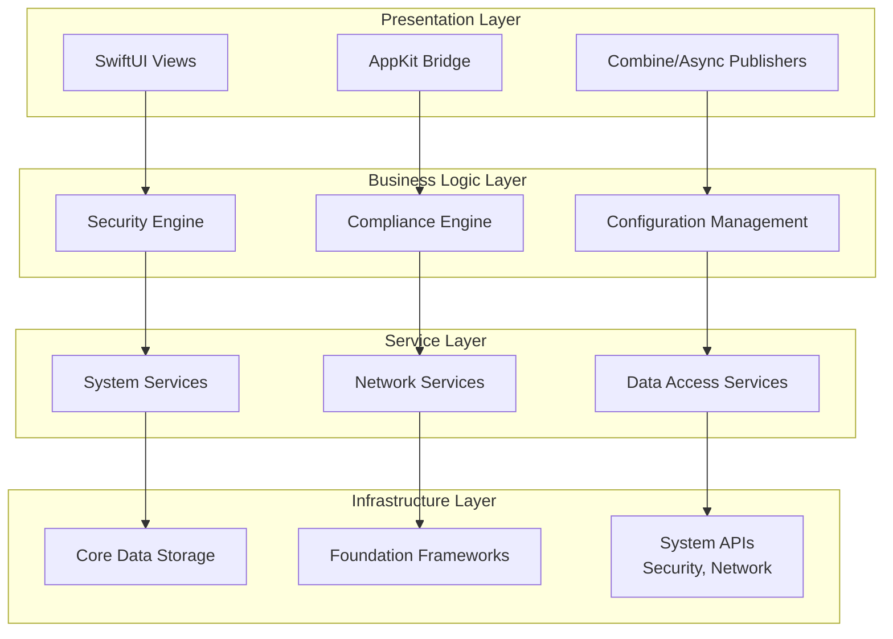
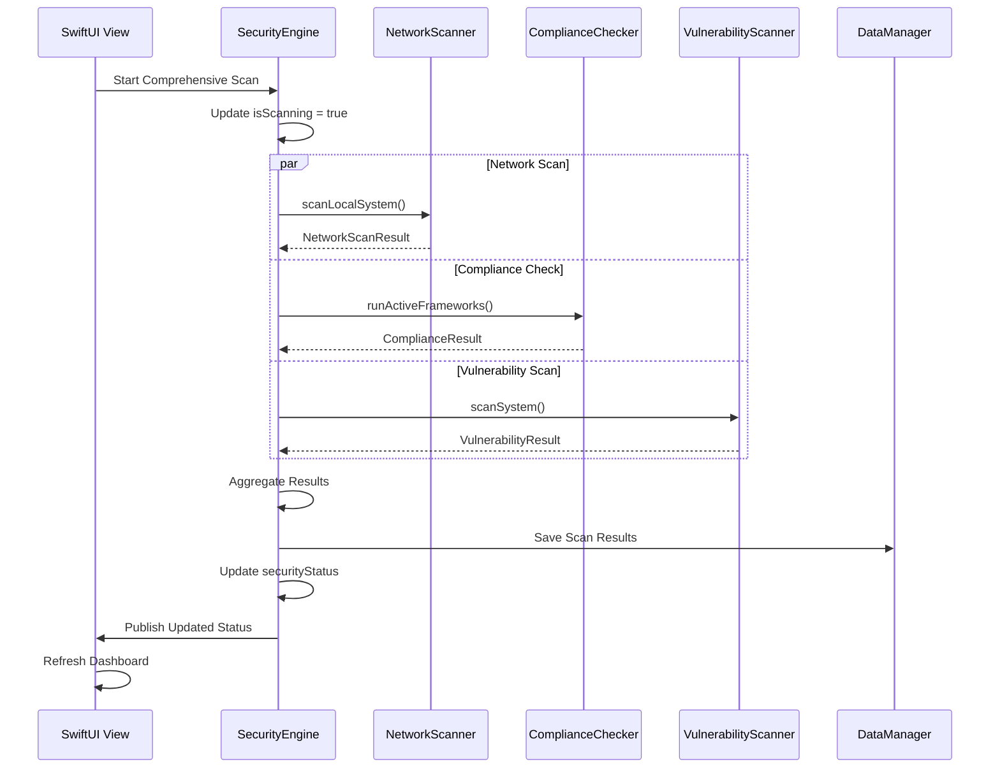
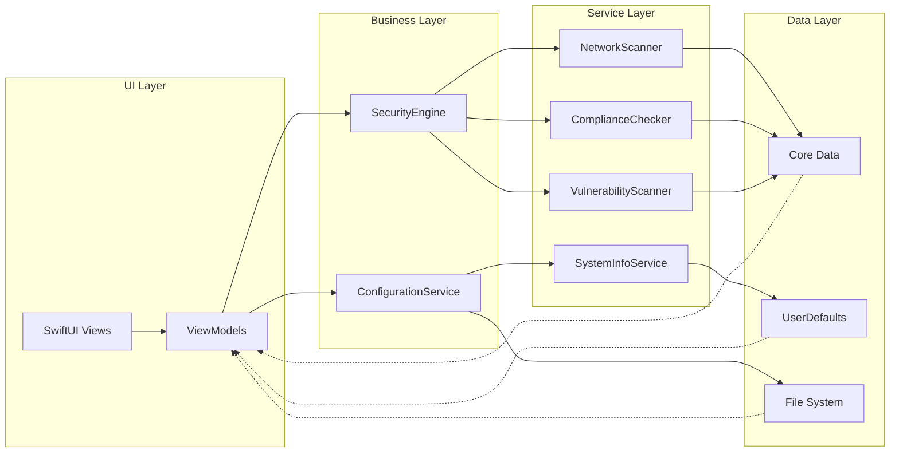
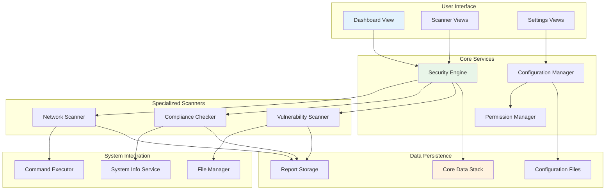

# Architecture Design - Albator Swift Application

## 🏗️ Overall Architecture

### High-Level Architecture Diagram



## 📱 Application Structure

### Main App Target Organization

```mermaid
graph TD
    A[AlbatorApp] --> B[App/]
    A --> C[Views/]
    A --> D[Models/]
    A --> E[Services/]
    A --> F[Utilities/]
    A --> G[Resources/]
    
    B --> B1[AlbatorApp.swift]
    B --> B2[AppDelegate.swift]
    B --> B3[WindowGroup.swift]
    
    C --> C1[Main/]
    C --> C2[Security/]
    C --> C3[Configuration/]
    C --> C4[Reports/]
    C --> C5[Shared/]
    
    C1 --> C1a[MainWindowView.swift]
    C1 --> C1b[SidebarView.swift]
    C1 --> C1c[WelcomeView.swift]
    
    C2 --> C2a[Dashboard/]
    C2 --> C2b[NetworkScanner/]
    C2 --> C2c[Compliance/]
    C2 --> C2d[Vulnerability/]
    
    C2a --> C2a1[SecurityDashboard.swift]
    C2a --> C2a2[StatusCards.swift]
    
    C2b --> C2b1[NetworkScannerView.swift]
    C2b --> C2b2[ScanConfiguration.swift]
    
    C2c --> C2c1[ComplianceView.swift]
    C2c --> C2c2[CheckResults.swift]
    
    C2d --> C2d1[VulnerabilityView.swift]
    C2d --> C2d2[RiskAssessment.swift]
    
    E --> E1[SecurityEngine/]
    E --> E2[System/]
    E --> E3[Configuration/]
    E --> E4[Data/]
    
    E1 --> E1a[SecurityEngine.swift]
    E1 --> E1b[NetworkScanner.swift]
    E1 --> E1c[ComplianceChecker.swift]
    
    style A fill:#e1f5fe
    style C2 fill:#f3e5f5
    style E1 fill:#e8f5e8
```



## 🔧 Service Layer Architecture

### Security Engine Core

```swift
// SecurityEngine.swift - Main security orchestration
@MainActor
class SecurityEngine: ObservableObject {
    // Published properties for UI binding
    @Published var securityStatus: SecurityStatus = .unknown
    @Published var riskScore: Double = 0.0
    @Published var isScanning: Bool = false
    @Published var lastScanDate: Date?
    
    // Service dependencies
    private let networkScanner: NetworkScanner
    private let complianceChecker: ComplianceChecker
    private let vulnerabilityScanner: VulnerabilityScanner
    private let systemInfo: SystemInfoService
    private let configService: ConfigurationService
    
    // Core functionality
    func performComprehensiveScan() async throws {
        isScanning = true
        defer { isScanning = false }
        
        async let networkResults = networkScanner.scanLocalSystem()
        async let complianceResults = complianceChecker.runActiveFrameworks()
        async let vulnResults = vulnerabilityScanner.scanSystem()
        
        let results = try await (networkResults, complianceResults, vulnResults)
        
        // Aggregate results and update UI
        await updateSecurityStatus(from: results)
        lastScanDate = Date()
    }
}

// NetworkScanner.swift - Network security scanning
class NetworkScanner: ObservableObject {
    @Published var discoveredServices: [NetworkService] = []
    @Published var vulnerableServices: [VulnerableService] = []
    
    private let scanQueue = DispatchQueue(label: "network.scan", qos: .userInitiated)
    private let maxConcurrentConnections = 50
    
    func scanLocalSystem() async throws -> NetworkScanResult {
        // Implementation details...
    }
    
    func scanPortRange(_ range: ClosedRange<Int>, on host: String) async throws -> [NetworkService] {
        // Concurrent port scanning implementation...
    }
}

// ComplianceChecker.swift - Security framework compliance
class ComplianceChecker: ObservableObject {
    @Published var activeFrameworks: [ComplianceFramework] = []
    @Published var complianceScores: [String: Double] = [:]
    
    private let frameworks: [ComplianceFramework]
    private let checkExecutor: CheckExecutor
    
    func runFramework(_ framework: ComplianceFramework) async throws -> ComplianceResult {
        // Framework-specific compliance checking...
    }
    
    func generateRemediationPlan(for failures: [ComplianceCheck]) -> RemediationPlan {
        // Remediation planning logic...
    }
}
```

### System Integration Services

```swift
// SystemInfoService.swift - System information gathering
class SystemInfoService: ObservableObject {
    @Published var systemInfo: SystemInformation?
    
    struct SystemInformation: Codable {
        let osVersion: String
        let buildNumber: String
        let architecture: String
        let installedApps: [Application]
        let runningServices: [Service]
        let networkInterfaces: [NetworkInterface]
        let securityFeatures: SecurityFeatures
    }
    
    func gatherSystemInformation() async throws -> SystemInformation {
        async let osInfo = getOperatingSystemInfo()
        async let apps = getInstalledApplications()
        async let services = getRunningServices()
        async let network = getNetworkConfiguration()
        async let security = getSecurityFeatureStatus()
        
        return try await SystemInformation(
            osVersion: osInfo.version,
            buildNumber: osInfo.build,
            architecture: osInfo.arch,
            installedApps: apps,
            runningServices: services,
            networkInterfaces: network,
            securityFeatures: security
        )
    }
}

// CommandExecutor.swift - Secure command execution
class CommandExecutor {
    enum ExecutionMode {
        case user
        case elevated
        case scripted(String)
    }
    
    private let authManager: AuthorizationManager
    
    func execute(
        _ command: String,
        mode: ExecutionMode = .user,
        timeout: TimeInterval = 30
    ) async throws -> CommandResult {
        
        switch mode {
        case .user:
            return try await executeUserCommand(command, timeout: timeout)
        case .elevated:
            return try await executeElevatedCommand(command, timeout: timeout)
        case .scripted(let script):
            return try await executeScript(script, timeout: timeout)
        }
    }
    
    private func executeElevatedCommand(_ command: String, timeout: TimeInterval) async throws -> CommandResult {
        // Use Authorization Services for privileged operations
        let authRef = try await authManager.obtainAuthorization()
        defer { authManager.releaseAuthorization(authRef) }
        
        // Execute with elevated privileges...
    }
}
```

## 📊 Data Layer Architecture

### Core Data Stack

```swift
// DataManager.swift - Core Data management
class DataManager: ObservableObject {
    static let shared = DataManager()
    
    lazy var persistentContainer: NSPersistentContainer = {
        let container = NSPersistentContainer(name: "AlbatorDataModel")
        
        // Configure for performance
        container.persistentStoreDescriptions.first?.setOption(true as NSNumber, 
                                                               forKey: NSPersistentHistoryTrackingKey)
        container.persistentStoreDescriptions.first?.setOption(true as NSNumber, 
                                                               forKey: NSPersistentStoreRemoteChangeNotificationPostOptionKey)
        
        container.loadPersistentStores { _, error in
            if let error = error {
                fatalError("Core Data error: \(error)")
            }
        }
        
        container.viewContext.automaticallyMergesChangesFromParent = true
        return container
    }()
    
    var context: NSManagedObjectContext {
        persistentContainer.viewContext
    }
    
    func backgroundContext() -> NSManagedObjectContext {
        return persistentContainer.newBackgroundContext()
    }
    
    func save() {
        if context.hasChanges {
            do {
                try context.save()
            } catch {
                Logger.shared.error("Failed to save context: \(error)")
            }
        }
    }
}

// Entity Models
@objc(SecurityScan)
public class SecurityScan: NSManagedObject {
    @NSManaged public var id: UUID
    @NSManaged public var date: Date
    @NSManaged public var type: String
    @NSManaged public var riskScore: Double
    @NSManaged public var resultsData: Data
    @NSManaged public var framework: String?
    @NSManaged public var duration: TimeInterval
}

@objc(ComplianceResult)
public class ComplianceResult: NSManagedObject {
    @NSManaged public var id: UUID
    @NSManaged public var scanId: UUID
    @NSManaged public var framework: String
    @NSManaged public var checkId: String
    @NSManaged public var status: String
    @NSManaged public var severity: String
    @NSManaged public var details: String
}
```

### Configuration Storage

```swift
// ConfigurationService.swift - Settings and profile management
class ConfigurationService: ObservableObject {
    @Published var currentProfile: SecurityProfile?
    @Published var availableProfiles: [SecurityProfile] = []
    @Published var applicationSettings: ApplicationSettings
    
    private let userDefaults = UserDefaults.standard
    private let configurationURL: URL
    
    init() {
        // Initialize configuration storage location
        let appSupport = FileManager.default.urls(for: .applicationSupportDirectory, 
                                                 in: .userDomainMask)[0]
        let albatorDir = appSupport.appendingPathComponent("Albator")
        configurationURL = albatorDir.appendingPathComponent("configuration.json")
        
        // Create directory if needed
        try? FileManager.default.createDirectory(at: albatorDir, 
                                               withIntermediateDirectories: true)
        
        applicationSettings = ApplicationSettings.default
        loadConfiguration()
    }
    
    func saveConfiguration() {
        let configuration = AppConfiguration(
            profiles: availableProfiles,
            activeProfileId: currentProfile?.id,
            settings: applicationSettings
        )
        
        do {
            let data = try JSONEncoder().encode(configuration)
            try data.write(to: configurationURL)
        } catch {
            Logger.shared.error("Failed to save configuration: \(error)")
        }
    }
    
    func importProfile(from url: URL) throws -> SecurityProfile {
        let data = try Data(contentsOf: url)
        let profile = try JSONDecoder().decode(SecurityProfile.self, from: data)
        
        // Validate profile before adding
        try validateProfile(profile)
        
        availableProfiles.append(profile)
        saveConfiguration()
        
        return profile
    }
}
```

## 🔄 Reactive Architecture

### Combine Integration

```swift
// SecurityModel.swift - Reactive data model
class SecurityModel: ObservableObject {
    @Published var securityStatus: SecurityStatus = .unknown
    @Published var alerts: [SecurityAlert] = []
    @Published var scanProgress: Double = 0.0
    
    private var cancellables = Set<AnyCancellable>()
    private let securityEngine: SecurityEngine
    
    init(securityEngine: SecurityEngine) {
        self.securityEngine = securityEngine
        setupBindings()
    }
    
    private func setupBindings() {
        // React to security engine changes
        securityEngine.$riskScore
            .map { score in
                switch score {
                case 0..<25: return .secure
                case 25..<50: return .warning
                case 50..<75: return .concerning
                default: return .critical
                }
            }
            .assign(to: &$securityStatus)
        
        // Monitor for new alerts
        securityEngine.$lastScanResults
            .compactMap { $0 }
            .map { results in
                results.criticalIssues.map { issue in
                    SecurityAlert(
                        severity: .high,
                        title: issue.title,
                        message: issue.description,
                        action: issue.remediation
                    )
                }
            }
            .assign(to: &$alerts)
        
        // Progress tracking
        securityEngine.scanProgressPublisher
            .receive(on: DispatchQueue.main)
            .assign(to: &$scanProgress)
    }
}

// Publishers for async operations
extension SecurityEngine {
    var scanProgressPublisher: AnyPublisher<Double, Never> {
        NotificationCenter.default
            .publisher(for: .scanProgress)
            .compactMap { $0.userInfo?["progress"] as? Double }
            .eraseToAnyPublisher()
    }
    
    func startScanPublisher() -> AnyPublisher<ScanResult, ScanError> {
        Future { promise in
            Task {
                do {
                    let result = try await self.performComprehensiveScan()
                    promise(.success(result))
                } catch {
                    promise(.failure(error as? ScanError ?? .unknown))
                }
            }
        }
        .eraseToAnyPublisher()
    }
}
```

## 🎨 UI Architecture Patterns

### MVVM with SwiftUI

```swift
// SecurityDashboardViewModel.swift
@MainActor
class SecurityDashboardViewModel: ObservableObject {
    @Published var dashboardState: DashboardState = .loading
    @Published var securityMetrics: SecurityMetrics?
    @Published var recentActivity: [ActivityItem] = []
    @Published var quickActions: [QuickAction] = []
    
    private let securityEngine: SecurityEngine
    private let dataManager: DataManager
    
    enum DashboardState {
        case loading
        case loaded
        case error(String)
        case refreshing
    }
    
    init(securityEngine: SecurityEngine, dataManager: DataManager) {
        self.securityEngine = securityEngine
        self.dataManager = dataManager
    }
    
    func loadDashboard() async {
        dashboardState = .loading
        
        do {
            async let metrics = loadSecurityMetrics()
            async let activity = loadRecentActivity()
            async let actions = loadQuickActions()
            
            let (metricsResult, activityResult, actionsResult) = try await (metrics, activity, actions)
            
            securityMetrics = metricsResult
            recentActivity = activityResult
            quickActions = actionsResult
            dashboardState = .loaded
            
        } catch {
            dashboardState = .error(error.localizedDescription)
        }
    }
    
    func refreshData() async {
        guard dashboardState != .loading else { return }
        
        dashboardState = .refreshing
        await loadDashboard()
    }
}

// SecurityDashboard.swift - SwiftUI View
struct SecurityDashboard: View {
    @StateObject private var viewModel: SecurityDashboardViewModel
    @Environment(\.refresh) private var refresh
    
    var body: some View {
        Group {
            switch viewModel.dashboardState {
            case .loading:
                ProgressView("Loading security status...")
                    .frame(maxWidth: .infinity, maxHeight: .infinity)
                
            case .loaded:
                dashboardContent
                
            case .error(let message):
                ErrorView(message: message) {
                    Task { await viewModel.loadDashboard() }
                }
                
            case .refreshing:
                dashboardContent
                    .disabled(true)
                    .overlay(ProgressView().frame(maxWidth: .infinity, maxHeight: .infinity))
            }
        }
        .navigationTitle("Security Dashboard")
        .refreshable {
            await viewModel.refreshData()
        }
        .task {
            await viewModel.loadDashboard()
        }
    }
    
    @ViewBuilder
    private var dashboardContent: some View {
        ScrollView {
            LazyVGrid(columns: [
                GridItem(.flexible()),
                GridItem(.flexible())
            ], spacing: 20) {
                
                if let metrics = viewModel.securityMetrics {
                    SecurityOverviewCard(metrics: metrics)
                    RiskScoreCard(score: metrics.riskScore)
                    ComplianceStatusCard(compliance: metrics.compliance)
                    VulnerabilityCard(vulnerabilities: metrics.vulnerabilities)
                }
                
                RecentActivityCard(activities: viewModel.recentActivity)
                QuickActionsCard(actions: viewModel.quickActions)
            }
            .padding()
        }
    }
}
```

## 🔗 Integration Patterns

### Service Communication

```swift
// ServiceCoordinator.swift - Coordinates between services
actor ServiceCoordinator {
    private var activeOperations: [UUID: OperationInfo] = [:]
    private let maxConcurrentOperations = 3
    
    struct OperationInfo {
        let type: OperationType
        let startTime: Date
        let priority: Priority
    }
    
    enum OperationType {
        case networkScan
        case complianceScan
        case vulnerabilityScan
        case systemInfo
    }
    
    func requestOperation(_ type: OperationType, priority: Priority = .normal) async -> UUID? {
        guard activeOperations.count < maxConcurrentOperations else {
            return nil
        }
        
        let operationId = UUID()
        activeOperations[operationId] = OperationInfo(
            type: type,
            startTime: Date(),
            priority: priority
        )
        
        return operationId
    }
    
    func completeOperation(_ id: UUID) {
        activeOperations.removeValue(forKey: id)
    }
}

// Event-driven communication
extension NotificationCenter {
    static let securityScanCompleted = Notification.Name("securityScanCompleted")
    static let configurationChanged = Notification.Name("configurationChanged")
    static let criticalAlertDetected = Notification.Name("criticalAlertDetected")
}

// Event publishing
class EventPublisher {
    static let shared = EventPublisher()
    
    func publishScanComplete(_ result: ScanResult) {
        NotificationCenter.default.post(
            name: .securityScanCompleted,
            object: self,
            userInfo: ["result": result]
        )
    }
    
    func publishCriticalAlert(_ alert: SecurityAlert) {
        NotificationCenter.default.post(
            name: .criticalAlertDetected,
            object: self,
            userInfo: ["alert": alert]
        )
    }
}
```

## 🔄 Security Scan Workflow



## 🏗️ Data Flow Architecture



## 🎯 Component Interaction Flow



This architecture provides a solid foundation for building a scalable, maintainable Swift application while maintaining clear separation of concerns and leveraging modern Swift/SwiftUI patterns.