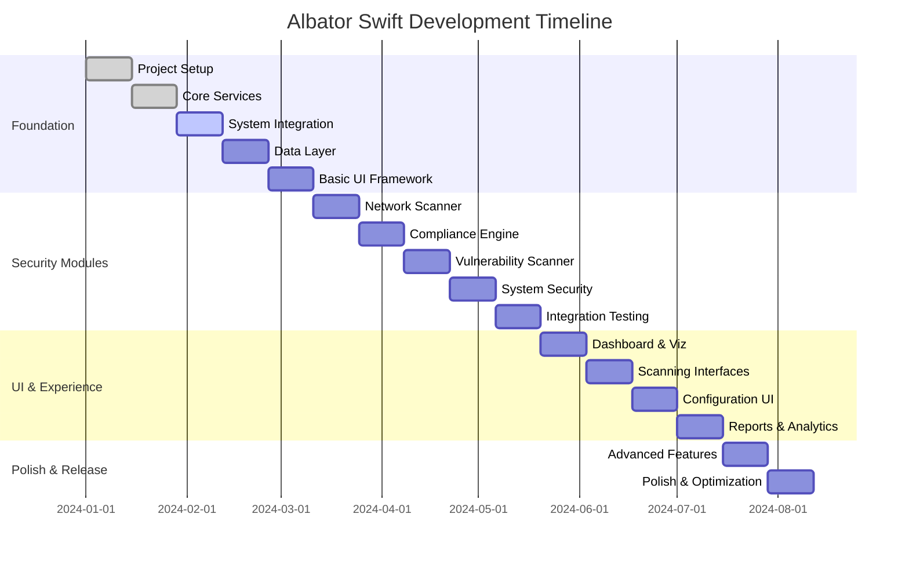
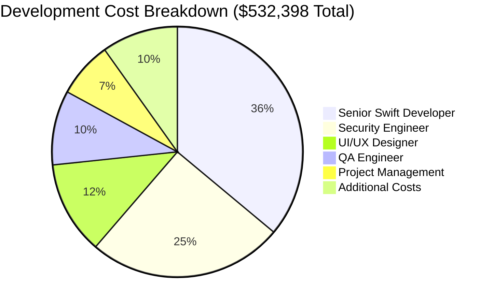
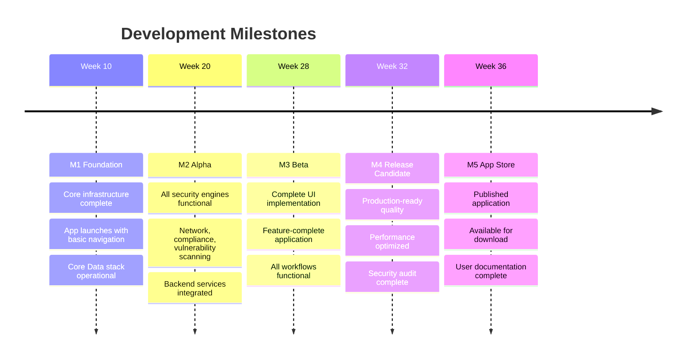
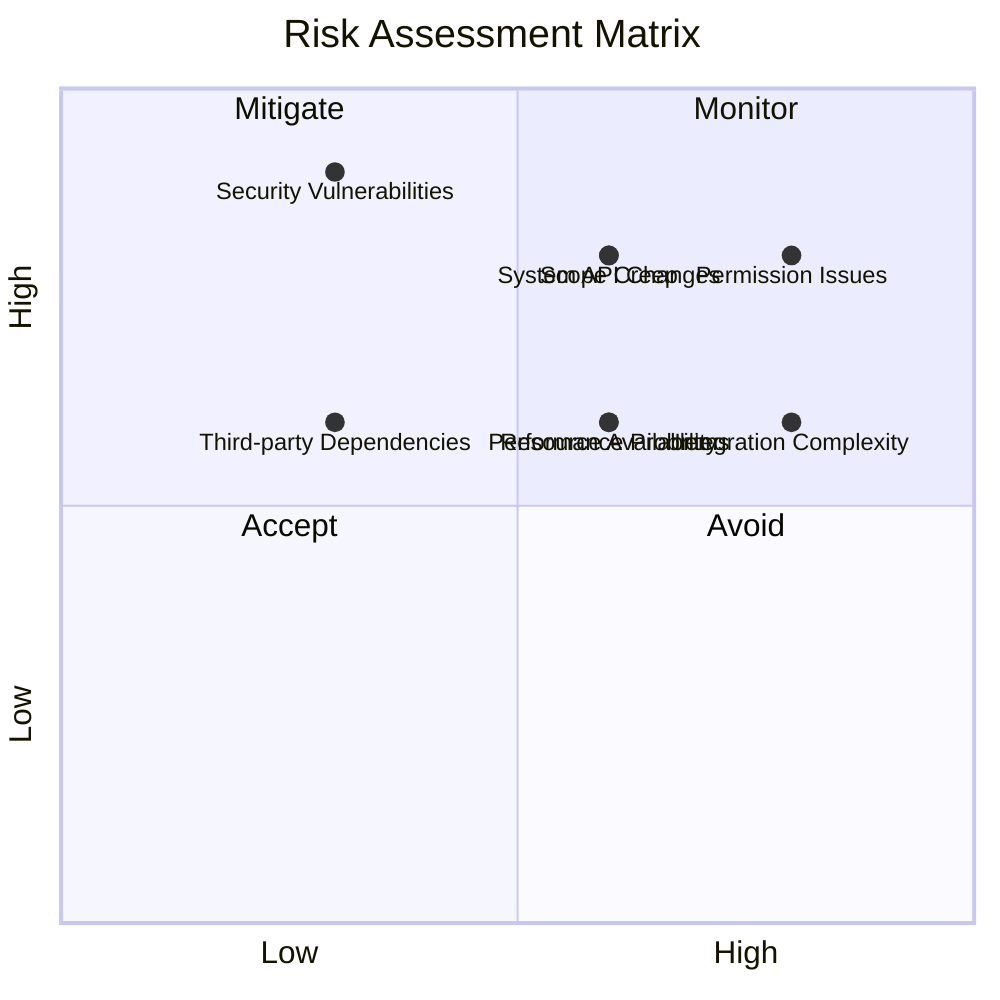

# Development Plan - Albator Swift Application

## 📋 Project Overview

**Estimated Timeline:** 6-8 months (190-245 development days)
**Team Size:** 2-3 developers
**Target Platform:** macOS 13.0+ (Ventura and later)
**Technologies:** Swift 5.9+, SwiftUI 4.0+, Combine, Core Data

## 👥 Team Requirements

### Core Team Structure

| Role | Responsibility | Time Allocation | Skills Required |
|------|----------------|-----------------|-----------------|
| **Senior Swift Developer** | Architecture, Core Features, UI | 100% (8 months) | SwiftUI, AppKit, System APIs |
| **Security Engineer** | Security Logic, System Integration | 75% (6 months) | macOS Security, Networking |
| **UI/UX Designer** | Interface Design, User Experience | 50% (4 months) | macOS Design, Prototyping |
| **QA Engineer** | Testing, Validation, Performance | 50% (4 months) | iOS/macOS Testing, Security |

### Skills Matrix

**Required Skills:**
- ✅ **Advanced Swift/SwiftUI** (5+ years)
- ✅ **macOS Development** (3+ years)
- ✅ **System Programming** (Network, Security APIs)
- ✅ **Core Data/SwiftData** experience
- ✅ **Security Frameworks** knowledge
- ✅ **Performance Optimization** experience

**Nice-to-Have:**
- 🔄 **Python to Swift** migration experience
- 🔄 **Security Tooling** development
- 🔄 **Enterprise Software** experience
- 🔄 **App Store Distribution** knowledge

## 📅 Development Phases



### Phase 1: Foundation & Core Infrastructure (Weeks 1-10)

**Duration:** 10 weeks  
**Team:** Full team  
**Deliverables:** Basic app structure, core services, initial UI

#### Week 1-2: Project Setup
- [ ] Xcode project configuration
- [ ] Team development environment setup
- [ ] Git repository and CI/CD pipeline
- [ ] Core Data model design
- [ ] Initial app structure and navigation

```swift
// Initial project structure setup
struct AlbatorApp: App {
    var body: some Scene {
        WindowGroup {
            MainWindowView()
                .environmentObject(SecurityEngine())
                .environmentObject(ConfigurationService())
        }
    }
}
```

#### Week 3-4: Core Services Architecture
- [ ] Security engine foundation
- [ ] Configuration service implementation
- [ ] Command execution framework
- [ ] Permission management system
- [ ] Logging and error handling

```swift
// Core service interfaces
protocol SecurityEngine {
    func performScan(_ type: ScanType) async throws -> ScanResult
    func getSecurityStatus() async -> SecurityStatus
}

protocol ConfigurationService {
    func loadProfile(_ name: String) throws -> SecurityProfile
    func saveProfile(_ profile: SecurityProfile) throws
}
```

#### Week 5-6: System Integration
- [ ] macOS system information gathering
- [ ] Command execution with proper privileges
- [ ] File system access and permissions
- [ ] Network interface implementation
- [ ] Security framework integration

#### Week 7-8: Data Layer
- [ ] Core Data stack implementation
- [ ] Entity models and relationships
- [ ] Data persistence and caching
- [ ] Import/export functionality
- [ ] Migration system for updates

#### Week 9-10: Basic UI Framework
- [ ] Main window and navigation
- [ ] Basic dashboard layout
- [ ] Settings and preferences UI
- [ ] Progress indicators and status views
- [ ] Error handling and user feedback

**Phase 1 Deliverables:**
- ✅ Functional app shell with navigation
- ✅ Core services architecture
- ✅ Basic system integration
- ✅ Data persistence foundation
- ✅ Initial UI components

### Phase 2: Security Modules Implementation (Weeks 11-20)

**Duration:** 10 weeks  
**Team:** 2-3 developers (focus on backend)  
**Deliverables:** Complete security scanning capabilities

#### Week 11-12: Network Security Scanner
- [ ] Port scanning implementation
- [ ] Service detection and identification
- [ ] Vulnerability database integration
- [ ] Network configuration analysis
- [ ] Risk assessment algorithms

```swift
// Network scanner implementation
class NetworkScanner: ObservableObject {
    @Published var scanResults: [NetworkService] = []
    @Published var isScanning = false
    
    func scanPorts(host: String, range: ClosedRange<Int>) async {
        // Concurrent port scanning implementation
    }
}
```

#### Week 13-14: Compliance Engine
- [ ] NIST 800-53 framework implementation
- [ ] CIS macOS benchmark checks
- [ ] SOC2 compliance validation
- [ ] Custom framework support
- [ ] Remediation recommendation engine

#### Week 15-16: Vulnerability Scanner
- [ ] Configuration vulnerability detection
- [ ] Software vulnerability assessment
- [ ] CVE database integration
- [ ] Risk scoring and prioritization
- [ ] Automated remediation suggestions

#### Week 17-18: System Security Analysis
- [ ] macOS security settings analysis
- [ ] Privacy configuration validation
- [ ] Firewall and network security
- [ ] Application security assessment
- [ ] System hardening recommendations

#### Week 19-20: Integration & Testing
- [ ] Service integration testing
- [ ] Performance optimization
- [ ] Error handling and edge cases
- [ ] Security engine coordination
- [ ] Initial UI integration

**Phase 2 Deliverables:**
- ✅ Complete network scanning functionality
- ✅ Multi-framework compliance checking
- ✅ Comprehensive vulnerability assessment
- ✅ System security analysis engine
- ✅ Integrated security orchestration

### Phase 3: User Interface & Experience (Weeks 21-28)

**Duration:** 8 weeks  
**Team:** Full team (focus on UI/UX)  
**Deliverables:** Complete user interface and workflows

#### Week 21-22: Dashboard & Visualization
- [ ] Security status dashboard
- [ ] Risk score visualization
- [ ] Compliance status displays
- [ ] Historical trend charts
- [ ] Interactive data exploration

```swift
// Dashboard implementation with Charts
struct SecurityDashboard: View {
    var body: some View {
        LazyVGrid(columns: columns) {
            SecurityOverviewCard()
            RiskTrendChart()
            ComplianceStatusGrid()
            RecentScansView()
        }
    }
}
```

#### Week 23-24: Scanning Interfaces
- [ ] Network scanner UI with real-time results
- [ ] Compliance checker interface
- [ ] Vulnerability scanner display
- [ ] Scan configuration and customization
- [ ] Results filtering and search

#### Week 25-26: Configuration Management UI
- [ ] Security profile editor
- [ ] Settings and preferences
- [ ] Rule customization interface
- [ ] Import/export workflows
- [ ] Profile validation and testing

#### Week 27-28: Reports & Analytics
- [ ] Report generation interface
- [ ] Multiple export formats
- [ ] Scheduled reporting
- [ ] Historical analysis views
- [ ] Executive summary generation

**Phase 3 Deliverables:**
- ✅ Complete user interface
- ✅ Rich data visualization
- ✅ Intuitive workflows
- ✅ Comprehensive reporting
- ✅ Professional appearance

### Phase 4: Advanced Features & Polish (Weeks 29-32)

**Duration:** 4 weeks  
**Team:** 2-3 developers  
**Deliverables:** Advanced features and final polish

#### Week 29-30: Advanced Features
- [ ] Automated scanning schedules
- [ ] Custom rule creation
- [ ] Integration with external tools
- [ ] Advanced filtering and search
- [ ] Batch operations support

#### Week 31-32: Polish & Optimization
- [ ] Performance optimization
- [ ] Memory usage optimization
- [ ] UI polish and animations
- [ ] Accessibility improvements
- [ ] Help system and documentation

**Phase 4 Deliverables:**
- ✅ Advanced automation features
- ✅ Optimized performance
- ✅ Polished user experience
- ✅ Complete documentation
- ✅ Accessibility compliance

## 💰 Cost Estimation

### Development Costs



| Resource | Rate | Duration | Total Cost |
|----------|------|----------|------------|
| **Senior Swift Developer** | $150/hour | 8 months (1,280 hours) | $192,000 |
| **Security Engineer** | $140/hour | 6 months (960 hours) | $134,400 |
| **UI/UX Designer** | $100/hour | 4 months (640 hours) | $64,000 |
| **QA Engineer** | $80/hour | 4 months (640 hours) | $51,200 |
| **Project Management** | $120/hour | 8 months (320 hours) | $38,400 |

**Total Development Cost: $480,000**

### Additional Costs

| Item | Cost | Notes |
|------|------|-------|
| **Apple Developer Program** | $99/year | Required for distribution |
| **Code Signing Certificate** | $299/year | Developer ID for notarization |
| **Design Tools** | $2,000 | Sketch, Figma, other design software |
| **Development Hardware** | $15,000 | Mac development machines |
| **Testing Devices** | $5,000 | Various Mac models for testing |
| **Third-party Libraries** | $5,000 | Commercial frameworks if needed |
| **Security Audit** | $25,000 | Independent security review |

**Total Additional Costs: $52,398**

**Grand Total Project Cost: $532,398**

## 📊 Resource Planning

### Sprint Planning (2-week sprints)

**Sprint Structure:**
- **Planning:** 2 hours
- **Daily Standups:** 15 minutes × 10 days = 2.5 hours
- **Sprint Review:** 1 hour
- **Retrospective:** 1 hour
- **Development:** 70 hours per person per sprint

### Milestone Schedule



## 🧪 Testing Strategy

### Testing Phases

#### Unit Testing (Ongoing)
- [ ] Core service unit tests
- [ ] Business logic validation
- [ ] Data model testing
- [ ] Utility function verification
- **Target:** 80% code coverage

#### Integration Testing (Phases 2-3)
- [ ] Service interaction testing
- [ ] System integration validation
- [ ] Permission handling verification
- [ ] Error scenario testing
- **Target:** All critical paths covered

#### UI Testing (Phase 3-4)
- [ ] User workflow validation
- [ ] Accessibility testing
- [ ] Performance testing
- [ ] Visual regression testing
- **Target:** All user flows tested

#### Security Testing (Phase 4)
- [ ] Penetration testing
- [ ] Code security review
- [ ] Privilege escalation testing
- [ ] Input validation verification
- **Target:** Security audit completion

### Testing Tools & Frameworks

```swift
// XCTest for unit testing
class SecurityEngineTests: XCTestCase {
    func testNetworkScanPerformance() async {
        let engine = SecurityEngine()
        
        measure {
            let expectation = XCTestExpectation(description: "Network scan")
            Task {
                await engine.scanNetwork()
                expectation.fulfill()
            }
            wait(for: [expectation], timeout: 30.0)
        }
    }
}

// XCUITest for UI testing
class AlbatorUITests: XCTestCase {
    func testCompleteSecurityScanWorkflow() {
        let app = XCUIApplication()
        app.launch()
        
        // Navigate to security scanner
        app.buttons["Security Scanner"].tap()
        
        // Start scan
        app.buttons["Start Scan"].tap()
        
        // Verify results appear
        XCTAssertTrue(app.tables["Scan Results"].waitForExistence(timeout: 60))
    }
}
```

## 🚀 Deployment Strategy

### Development Environment
- **Local Development:** Xcode + Git
- **CI/CD:** GitHub Actions or Xcode Cloud
- **Testing:** Automated testing on commit
- **Code Review:** Pull request workflow

### Staging Environment
- **TestFlight:** Internal testing distribution
- **Performance Testing:** Real device testing
- **Security Testing:** Penetration testing
- **User Acceptance Testing:** Stakeholder validation

### Production Deployment
- **Code Signing:** Developer ID certificate
- **Notarization:** Apple notarization service
- **Distribution:** DMG installer + Mac App Store
- **Updates:** Automatic update mechanism

### Distribution Options

#### Direct Distribution
```bash
# Build and notarize for direct distribution
xcodebuild -project Albator.xcodeproj \
           -scheme Albator \
           -configuration Release \
           -archivePath ./build/Albator.xcarchive \
           archive

# Create installer package
productbuild --component ./build/Albator.app /Applications \
             --sign "Developer ID Installer: Company Name" \
             Albator-Installer.pkg

# Notarize the installer
xcrun notarytool submit Albator-Installer.pkg \
     --keychain-profile "notary-profile" \
     --wait
```

#### Mac App Store
- **Sandboxing:** Required for App Store
- **Entitlements:** Limited system access
- **Review Process:** 7-14 day review
- **Revenue Share:** 30% to Apple

## 📈 Risk Management

### Risk Assessment Matrix



### Technical Risks

| Risk | Probability | Impact | Mitigation |
|------|-------------|--------|------------|
| **System API Changes** | Medium | High | Early testing, fallback implementations |
| **Permission Issues** | High | High | Prototype early, alternative approaches |
| **Performance Problems** | Medium | Medium | Regular performance testing |
| **Security Vulnerabilities** | Low | High | Security audit, code review |

### Schedule Risks

| Risk | Probability | Impact | Mitigation |
|------|-------------|--------|------------|
| **Scope Creep** | Medium | High | Strict change control |
| **Resource Availability** | Medium | Medium | Cross-training, backup plans |
| **Third-party Dependencies** | Low | Medium | Vendor evaluation, alternatives |
| **Integration Complexity** | High | Medium | Incremental integration |

### Mitigation Strategies

1. **Weekly Risk Reviews** - Assess and address risks proactively
2. **Prototype Critical Features** - Validate feasibility early
3. **Incremental Delivery** - Deliver working software regularly
4. **Stakeholder Communication** - Regular updates and feedback
5. **Contingency Planning** - Alternative approaches ready

## 🎯 Success Metrics

### Technical Metrics
- **Code Coverage:** >80% unit test coverage
- **Performance:** UI response time <100ms
- **Memory Usage:** <200MB base, <500MB during scans
- **Crash Rate:** <0.1% of app sessions

### User Experience Metrics
- **Task Completion Rate:** >95% for core workflows
- **User Satisfaction:** >4.5/5 rating
- **Support Tickets:** <1% of users require support
- **Feature Adoption:** >80% for core features

### Business Metrics
- **Development Cost:** Within 10% of budget
- **Timeline:** Delivery within planned schedule
- **Quality:** <50 critical bugs in first release
- **Market Readiness:** App Store approval on first submission

---

*This development plan provides a comprehensive roadmap for successfully delivering the Albator Swift application.*