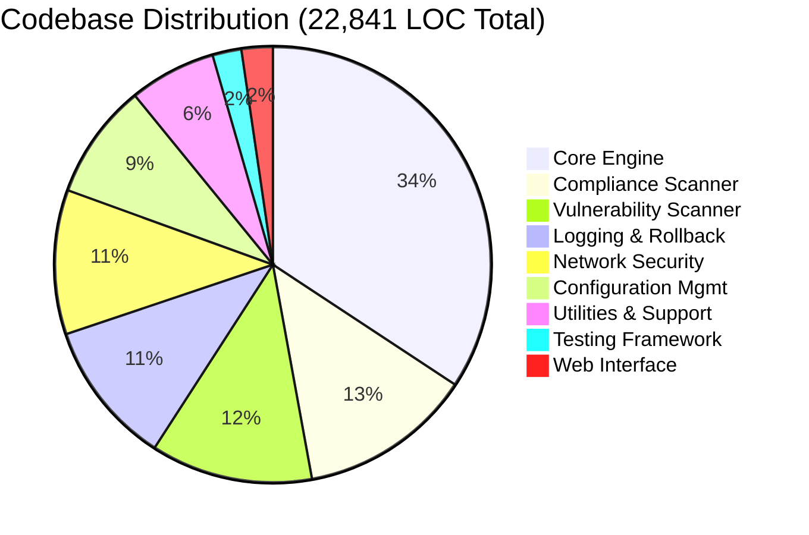
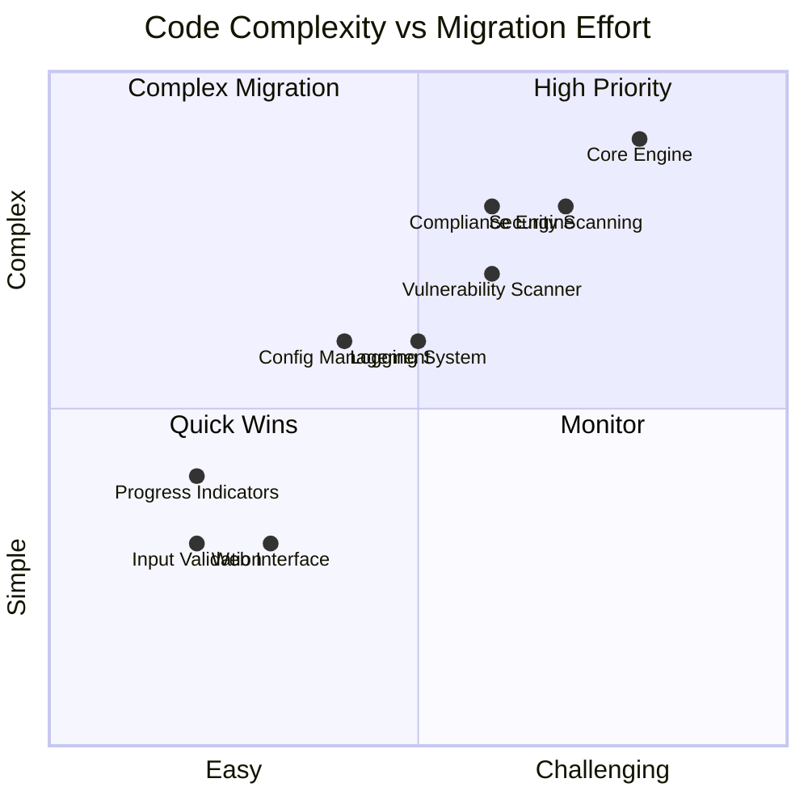
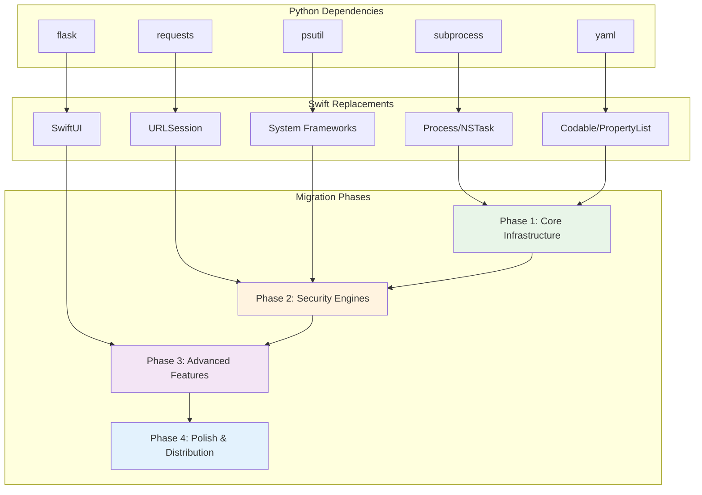

# Project Analysis - Current Albator Codebase

## 📊 Codebase Statistics

### Python Components
- **Total Python files:** 39 (excluding virtual environment)
- **Lines of code:** 22,841
- **Shell scripts:** 14 files
- **Configuration files:** Multiple YAML/JSON configs

### Core Modules Analysis



| Module | Files | LOC | Complexity | Description |
|--------|-------|-----|------------|-------------|
| **Core Engine** | 8 | ~8,000 | High | Main hardening logic, system integration |
| **Network Security** | 3 | ~2,500 | Medium | Port scanning, network analysis |
| **Compliance Scanner** | 2 | ~3,000 | Medium | NIST, CIS, SOC2 compliance checking |
| **Vulnerability Scanner** | 2 | ~2,800 | Medium | CVE integration, vulnerability assessment |
| **Configuration Management** | 4 | ~2,000 | Low-Medium | YAML config, profiles, validation |
| **Logging & Rollback** | 6 | ~2,500 | Medium | Enhanced logging, rollback system |
| **Utilities & Support** | 8 | ~1,500 | Low | Input validation, progress indicators |
| **Testing Framework** | 4 | ~500 | Low | Test validation, security checks |
| **Web Interface** | 2 | ~541 | Low | Flask-based GUI |

## 🏗️ Architecture Overview

### Current Python Architecture

```mermaid
graph TD
    A[Albator Python Project] --> B[Core Security Engine]
    A --> C[Security Modules]
    A --> D[Advanced Features]
    A --> E[Infrastructure]
    A --> F[Testing & Validation]
    A --> G[Configuration]
    
    B --> B1[albator.sh<br/>Main entry point]
    B --> B2[albator_cli.py<br/>CLI interface]
    B --> B3[albator_enhanced.py<br/>Advanced features]
    B --> B4[main.py<br/>Core baseline generator]
    
    C --> C1[firewall.sh]
    C --> C2[privacy.sh]
    C --> C3[encryption.sh]
    C --> C4[app_security.sh]
    C --> C5[reporting.sh]
    
    D --> D1[network_security_scanner.py]
    D --> D2[compliance_scanner.py]
    D --> D3[vulnerability_scanner.py]
    D --> D4[advanced_threat_detection.py]
    D --> D5[enhanced_rollback.py]
    
    E --> E1[enhanced_logger.py]
    E --> E2[config_manager.py]
    E --> E3[input_validator.py]
    E --> E4[progress_indicator.py]
    E --> E5[dependency_checker.py]
    
    F --> F1[validation.py]
    F --> F2[test_security.sh]
    F --> F3[test_framework.py]
    
    G --> G1[albator_config.yaml]
    G --> G2[rules/]
    G --> G3[includes/]
    
    style B fill:#ffebee
    style D fill:#e8f5e8
    style E fill:#e3f2fd
```



## 🔍 Feature Inventory

### Core Security Features
- ✅ **Firewall Configuration** - Enable/configure Application Layer Firewall
- ✅ **Privacy Settings** - Disable telemetry, analytics, tracking
- ✅ **Encryption Management** - FileVault encryption control
- ✅ **Application Security** - Gatekeeper, code signing verification
- ✅ **System Hardening** - SSH, guest account, screensaver controls
- ✅ **CVE Monitoring** - Security advisory fetching and analysis

### Advanced Security Features
- ✅ **Network Security Scanning** - Port scanning, service detection
- ✅ **Compliance Checking** - NIST 800-53, CIS macOS, SOC2 validation
- ✅ **Vulnerability Assessment** - Configuration and software vulnerabilities
- ✅ **Threat Detection** - Behavioral analysis, IOC scanning
- ✅ **Security Orchestration** - Automated response capabilities

### Infrastructure Features
- ✅ **Configuration Management** - Profile-based settings with inheritance
- ✅ **Enhanced Logging** - Structured logging with audit trails
- ✅ **Rollback System** - Comprehensive backup and restoration
- ✅ **Input Validation** - Security-focused input sanitization
- ✅ **Progress Indicators** - Visual feedback for operations
- ✅ **Dependency Checking** - System requirements validation

### Reporting & Analytics
- ✅ **Multiple Report Formats** - JSON, HTML, CSV output
- ✅ **Compliance Dashboards** - Framework-specific reporting
- ✅ **Risk Scoring** - Automated risk assessment
- ✅ **Trend Analysis** - Historical compliance tracking
- ✅ **Executive Summaries** - High-level security status

## 🔧 Technical Dependencies

### System Requirements
- **macOS 15.5 (Sequoia)** - Primary target platform
- **Python 3.8+** - Core runtime requirement
- **Administrative privileges** - Required for system modifications
- **Network connectivity** - For CVE/update fetching

### External Tools
- **curl** - HTTP requests and data fetching
- **jq** - JSON parsing and manipulation
- **pup** - HTML parsing (optional)
- **sudo** - Privileged operations

### Python Dependencies
```python
# Core dependencies
PyYAML>=6.0.1
python-dotenv>=1.0.0
psutil>=5.9.0
requests>=2.31.0

# Data analysis
pandas>=2.0.0
matplotlib>=3.7.0
numpy>=1.24.0

# Web interface
Flask>=2.3.3
Flask-SocketIO>=5.3.6

# Security
cryptography>=41.0.0
PyJWT>=2.8.0

# Cloud integration
boto3>=1.28.0
azure-storage-blob>=12.17.0
google-cloud-storage>=2.10.0
```

## 💫 Complexity Analysis Overview



## 📈 Code Complexity Analysis

### High Complexity Areas
1. **System Integration** (`main.py`, `albator.sh`)
   - Direct system command execution
   - Complex error handling and rollback logic
   - Multi-platform compatibility considerations

2. **Security Scanning** (`network_security_scanner.py`)
   - Network protocol handling
   - Concurrent port scanning
   - Service identification algorithms

3. **Compliance Engine** (`compliance_scanner.py`)
   - Multiple framework definitions
   - Complex rule evaluation logic
   - Result aggregation and scoring

### Medium Complexity Areas
1. **Configuration Management** (`config_manager.py`)
   - YAML parsing and validation
   - Profile inheritance logic
   - Environment-specific overrides

2. **Vulnerability Assessment** (`vulnerability_scanner.py`)
   - CVE integration and matching
   - Version comparison algorithms
   - Risk scoring calculations

3. **Logging System** (`enhanced_logger.py`)
   - Multi-format output handling
   - Structured logging implementation
   - Audit trail management

### Low Complexity Areas
1. **Input Validation** (`input_validator.py`)
   - Standard validation patterns
   - Security-focused sanitization
   - Type checking and conversion

2. **Progress Indicators** (`progress_indicator.py`)
   - UI feedback mechanisms
   - Threading for animations
   - Status tracking

## 🚧 Technical Debt & Issues

### Current Limitations
1. **Mixed Language Architecture** - Python + Shell scripts create maintenance overhead
2. **Limited GUI** - Web interface is basic, lacks rich interactions
3. **Platform Dependency** - Heavy reliance on macOS-specific commands
4. **Error Handling** - Inconsistent error handling across modules
5. **Testing Coverage** - Limited automated testing for complex scenarios

### Security Considerations
1. **Privilege Escalation** - Requires sudo for many operations
2. **Input Sanitization** - Shell injection prevention needed
3. **Credential Management** - Limited secure storage for sensitive data
4. **Audit Logging** - Need for comprehensive security event logging

### Performance Issues
1. **Sequential Operations** - Many operations run sequentially vs parallel
2. **Memory Usage** - Large data structures for compliance/vulnerability data
3. **Startup Time** - Slow initialization due to system information gathering

## 🔄 Migration Dependency Flow



## 🎯 Migration Readiness Assessment

### Well-Structured Components (Easy to Migrate)
- ✅ **Configuration Management** - Clean YAML-based system
- ✅ **Data Models** - Well-defined classes and structures
- ✅ **Validation Logic** - Reusable validation patterns
- ✅ **Reporting Engine** - Clear input/output interfaces

### Complex Components (Challenging to Migrate)
- ⚠️ **System Integration** - Heavy shell command usage
- ⚠️ **Network Operations** - Low-level socket programming
- ⚠️ **Security Operations** - Privileged system access
- ⚠️ **Multi-threading** - Complex concurrent operations

### Dependencies to Replace
- 🔄 **subprocess** → Process/NSTask
- 🔄 **requests** → URLSession
- 🔄 **psutil** → System frameworks
- 🔄 **flask** → SwiftUI
- 🔄 **yaml** → Codable/PropertyList

## 📋 Migration Recommendations

### Phase 1: Core Infrastructure
1. Replicate configuration management system
2. Implement logging and validation frameworks
3. Create basic GUI shell with navigation

### Phase 2: Security Engines
1. Port network scanning capabilities
2. Implement compliance checking logic
3. Build vulnerability assessment engine

### Phase 3: Advanced Features
1. Add advanced threat detection
2. Implement reporting and analytics
3. Create rich GUI interactions

### Phase 4: Polish & Distribution
1. Comprehensive testing and validation
2. Performance optimization
3. App Store preparation and distribution

---

*This analysis provides the foundation for planning the Swift migration effort.*