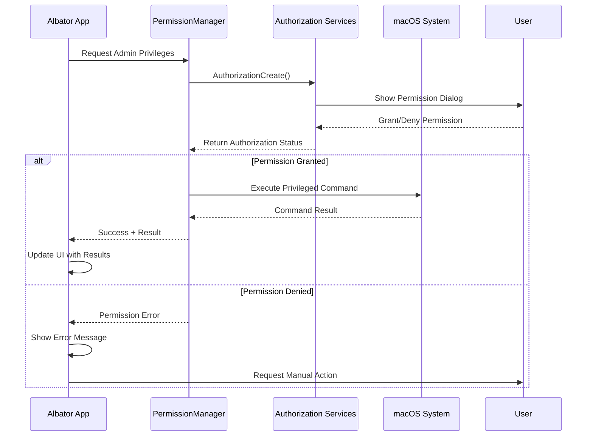
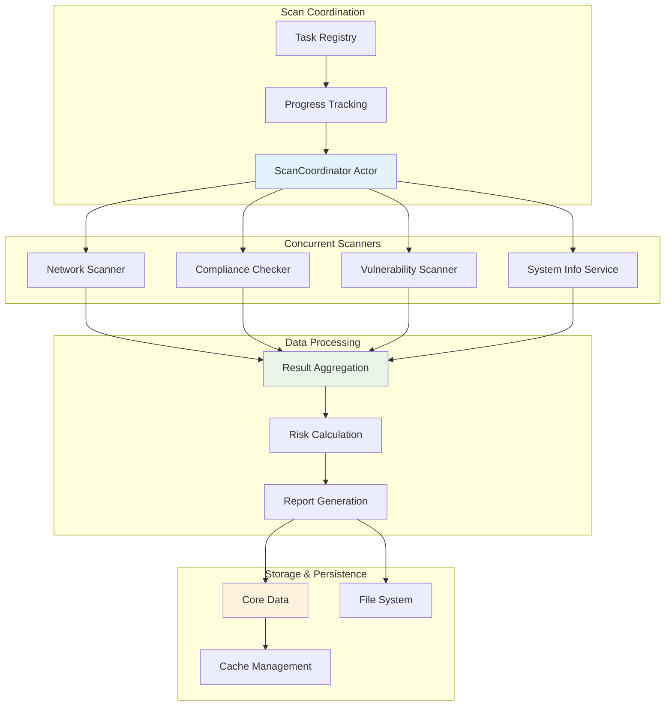
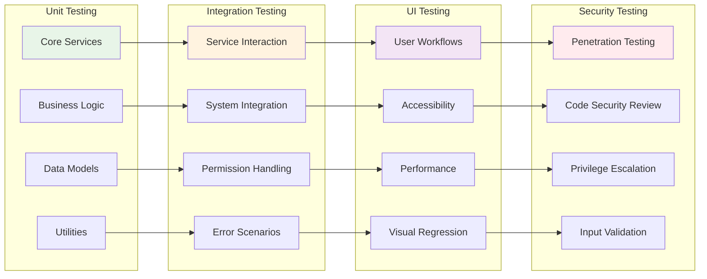

# Technical Requirements - Albator Swift Application

## 🎯 System Requirements

### Target Platform
- **macOS 13.0+** (Ventura and later)
- **Swift 5.9+** with SwiftUI 4.0+
- **Xcode 15.0+** for development
- **Intel/Apple Silicon** universal binary support

### Runtime Requirements
- **Administrative privileges** for security operations
- **Network connectivity** for CVE/update fetching
- **Disk space:** ~100MB for application + data
- **Memory:** ~200MB base + scan data

## 🏗️ Architecture Specifications

### Application Structure

```mermaid
graph TD
    A[AlbatorApp] --> B[Views/]
    A --> C[Models/]
    A --> D[Services/]
    A --> E[Utilities/]
    A --> F[Resources/]
    
    B --> B1[MainWindow/]
    B --> B2[Security/]
    B --> B3[Configuration/]
    B --> B4[Reports/]
    
    B1 --> B1a[MainWindowView.swift]
    B1 --> B1b[SidebarView.swift]
    B1 --> B1c[ContentView.swift]
    
    B2 --> B2a[SecurityDashboard.swift]
    B2 --> B2b[NetworkScannerView.swift]
    B2 --> B2c[ComplianceView.swift]
    B2 --> B2d[VulnerabilityView.swift]
    
    C --> C1[SecurityModels.swift]
    C --> C2[ConfigurationModels.swift]
    C --> C3[ReportModels.swift]
    C --> C4[SystemModels.swift]
    
    D --> D1[SecurityEngine/]
    D --> D2[System/]
    D --> D3[Configuration/]
    D --> D4[Data/]
    
    D1 --> D1a[SecurityEngine.swift]
    D1 --> D1b[NetworkScanner.swift]
    D1 --> D1c[ComplianceChecker.swift]
    
    E --> E1[Extensions/]
    E --> E2[Constants/]
    E --> E3[Helpers/]
    E --> E4[Logging/]
    
    F --> F1[Assets.xcassets]
    F --> F2[Localizable.strings]
    F --> F3[Configuration/]
    F --> F4[Frameworks/]
    
    style B2 fill:#f3e5f5
    style D1 fill:#e8f5e8
    style C fill:#fff3e0
```



## 🔐 Security & Permissions

### Required Entitlements

```xml
<!-- Albator.entitlements -->
<?xml version="1.0" encoding="UTF-8"?>
<!DOCTYPE plist PUBLIC "-//Apple//DTD PLIST 1.0//EN" "http://www.apple.com/DTDs/PropertyList-1.0.dtd">
<plist version="1.0">
<dict>
    <!-- Network access for scanning and CVE fetching -->
    <key>com.apple.security.network.client</key>
    <true/>
    <key>com.apple.security.network.server</key>
    <true/>
    
    <!-- File system access for configuration and reports -->
    <key>com.apple.security.files.user-selected.read-write</key>
    <true/>
    <key>com.apple.security.files.downloads.read-write</key>
    <true/>
    
    <!-- System configuration access -->
    <key>com.apple.security.temporary-exception.shared-preference.read-write</key>
    <true/>
    
    <!-- Process execution for system commands -->
    <key>com.apple.security.temporary-exception.unix-exec</key>
    <true/>
    
    <!-- Keychain access for secure storage -->
    <key>keychain-access-groups</key>
    <array>
        <string>$(AppIdentifierPrefix)com.cyberdyne.albator</string>
    </array>
</dict>
</plist>
```

### Permission Handling

```swift
// PermissionManager.swift
import SecurityInterface
import ServiceManagement

class PermissionManager: ObservableObject {
    @Published var hasAdminRights = false
    @Published var permissionStatus: PermissionStatus = .unknown
    
    enum PermissionStatus {
        case unknown, granted, denied, requiresElevation
    }
    
    func requestAdminPrivileges() async -> Bool {
        let authRef = UnsafeMutablePointer<AuthorizationRef?>.allocate(capacity: 1)
        defer { authRef.deallocate() }
        
        let status = AuthorizationCreate(nil, nil, [], authRef)
        guard status == errAuthorizationSuccess else { return false }
        
        let rights = AuthorizationRights()
        let flags: AuthorizationFlags = [.interactionAllowed, .preAuthorize, .extendRights]
        
        let authStatus = AuthorizationCopyRights(authRef.pointee!, &rights, nil, flags, nil)
        return authStatus == errAuthorizationSuccess
    }
}
```

## 🔄 Permission & Security Flow



## 🌐 Network & System Integration

### Command Execution Service

```swift
// CommandExecutor.swift
import Foundation

class CommandExecutor: ObservableObject {
    enum ExecutionError: Error {
        case permissionDenied
        case commandNotFound
        case executionTimeout
        case invalidOutput
    }
    
    func execute(_ command: String, timeout: TimeInterval = 30) async throws -> String {
        return try await withCheckedThrowingContinuation { continuation in
            let process = Process()
            let pipe = Pipe()
            
            process.standardOutput = pipe
            process.standardError = pipe
            process.executableURL = URL(fileURLWithPath: "/usr/bin/env")
            process.arguments = ["bash", "-c", command]
            
            process.terminationHandler = { process in
                let data = pipe.fileHandleForReading.readDataToEndOfFile()
                let output = String(data: data, encoding: .utf8) ?? ""
                
                if process.terminationStatus == 0 {
                    continuation.resume(returning: output)
                } else {
                    continuation.resume(throwing: ExecutionError.permissionDenied)
                }
            }
            
            do {
                try process.run()
            } catch {
                continuation.resume(throwing: ExecutionError.commandNotFound)
            }
        }
    }
}
```

### Network Scanner Implementation

```swift
// NetworkScanner.swift
import Network
import Foundation

class NetworkScanner: ObservableObject {
    @Published var scanResults: [NetworkService] = []
    @Published var isScanning = false
    
    struct NetworkService: Identifiable, Codable {
        let id = UUID()
        let port: Int
        let protocol: String
        let serviceName: String
        let state: String
    }
    
    func scanPorts(host: String, portRange: ClosedRange<Int>) async {
        await MainActor.run { isScanning = true }
        
        var services: [NetworkService] = []
        
        await withTaskGroup(of: NetworkService?.self) { group in
            for port in portRange {
                group.addTask {
                    await self.scanPort(host: host, port: port)
                }
            }
            
            for await service in group {
                if let service = service {
                    services.append(service)
                }
            }
        }
        
        await MainActor.run {
            self.scanResults = services.sorted { $0.port < $1.port }
            self.isScanning = false
        }
    }
    
    private func scanPort(host: String, port: Int) async -> NetworkService? {
        return await withCheckedContinuation { continuation in
            let connection = NWConnection(
                host: NWEndpoint.Host(host),
                port: NWEndpoint.Port(integerLiteral: UInt16(port)),
                using: .tcp
            )
            
            connection.start(queue: .global())
            
            DispatchQueue.global().asyncAfter(deadline: .now() + 1.0) {
                switch connection.state {
                case .ready:
                    let service = NetworkService(
                        port: port,
                        protocol: "tcp",
                        serviceName: self.identifyService(port: port),
                        state: "open"
                    )
                    connection.cancel()
                    continuation.resume(returning: service)
                default:
                    connection.cancel()
                    continuation.resume(returning: nil)
                }
            }
        }
    }
}
```

## 💾 Data Management

### Core Data Model

```swift
// DataModel.swift
import CoreData
import Foundation

@objc(SecurityScan)
public class SecurityScan: NSManagedObject {
    @NSManaged public var id: UUID
    @NSManaged public var date: Date
    @NSManaged public var scanType: String
    @NSManaged public var results: Data
    @NSManaged public var riskScore: Double
}

class DataManager: ObservableObject {
    lazy var persistentContainer: NSPersistentContainer = {
        let container = NSPersistentContainer(name: "AlbatorDataModel")
        container.loadPersistentStores { _, error in
            if let error = error {
                fatalError("Core Data error: \(error)")
            }
        }
        return container
    }()
    
    var context: NSManagedObjectContext {
        persistentContainer.viewContext
    }
    
    func save() {
        if context.hasChanges {
            try? context.save()
        }
    }
}
```

### Configuration Management

```swift
// ConfigurationService.swift
import Foundation

struct SecurityProfile: Codable, Identifiable {
    let id = UUID()
    var name: String
    var description: String
    var settings: SecuritySettings
    var inheritedFrom: String?
}

struct SecuritySettings: Codable {
    var firewall: FirewallSettings
    var privacy: PrivacySettings
    var encryption: EncryptionSettings
    var compliance: ComplianceSettings
}

class ConfigurationService: ObservableObject {
    @Published var profiles: [SecurityProfile] = []
    @Published var activeProfile: SecurityProfile?
    
    private let configURL: URL
    
    init() {
        let documentsPath = FileManager.default.urls(for: .documentDirectory, in: .userDomainMask)[0]
        configURL = documentsPath.appendingPathComponent("AlbatorConfig.json")
        loadProfiles()
    }
    
    func loadProfiles() {
        guard let data = try? Data(contentsOf: configURL),
              let profiles = try? JSONDecoder().decode([SecurityProfile].self, from: data) else {
            createDefaultProfiles()
            return
        }
        self.profiles = profiles
    }
    
    func saveProfiles() {
        guard let data = try? JSONEncoder().encode(profiles) else { return }
        try? data.write(to: configURL)
    }
}
```

## 🎨 User Interface Specifications

### SwiftUI Views Structure

```swift
// MainWindowView.swift
import SwiftUI

struct MainWindowView: View {
    @StateObject private var securityEngine = SecurityEngine()
    @StateObject private var configService = ConfigurationService()
    
    var body: some View {
        NavigationSplitView {
            SidebarView()
                .navigationSplitViewColumnWidth(min: 200, ideal: 250)
        } detail: {
            ContentView()
                .environmentObject(securityEngine)
                .environmentObject(configService)
        }
        .onAppear {
            securityEngine.initialize()
        }
    }
}

struct SidebarView: View {
    var body: some View {
        List {
            Section("Security") {
                NavigationLink("Dashboard", destination: SecurityDashboard())
                NavigationLink("Network Scanner", destination: NetworkScannerView())
                NavigationLink("Compliance", destination: ComplianceView())
                NavigationLink("Vulnerabilities", destination: VulnerabilityView())
            }
            
            Section("Configuration") {
                NavigationLink("Profiles", destination: ProfileManagerView())
                NavigationLink("Settings", destination: SettingsView())
            }
            
            Section("Reports") {
                NavigationLink("View Reports", destination: ReportViewer())
                NavigationLink("Export Data", destination: ExportView())
            }
        }
        .listStyle(SidebarListStyle())
    }
}
```

### Dashboard Components

```swift
// SecurityDashboard.swift
import SwiftUI
import Charts

struct SecurityDashboard: View {
    @EnvironmentObject var securityEngine: SecurityEngine
    @State private var refreshTask: Task<Void, Never>?
    
    var body: some View {
        ScrollView {
            LazyVStack(spacing: 20) {
                // Security Status Overview
                SecurityStatusCard()
                
                // Risk Score Chart
                RiskScoreChart(data: securityEngine.riskHistory)
                
                // Recent Scans
                RecentScansView(scans: securityEngine.recentScans)
                
                // Quick Actions
                QuickActionsView()
            }
            .padding()
        }
        .navigationTitle("Security Dashboard")
        .toolbar {
            ToolbarItem(placement: .primaryAction) {
                Button("Refresh") {
                    refreshTask = Task {
                        await securityEngine.refreshStatus()
                    }
                }
            }
        }
        .onDisappear {
            refreshTask?.cancel()
        }
    }
}
```

## 🔍 Security Scanning Architecture



## 📊 Performance Requirements

### Response Time Targets
- **UI interactions:** < 100ms
- **Quick scans:** < 30 seconds
- **Comprehensive scans:** < 5 minutes
- **Report generation:** < 10 seconds

### Memory Usage
- **Base application:** < 100MB
- **During scans:** < 500MB
- **Large datasets:** Streaming/pagination

### Concurrent Operations
```swift
// Support for concurrent scanning
actor ScanCoordinator {
    private var activeTasks: Set<UUID> = []
    private let maxConcurrentScans = 3
    
    func canStartNewScan() -> Bool {
        activeTasks.count < maxConcurrentScans
    }
    
    func registerTask(_ id: UUID) {
        activeTasks.insert(id)
    }
    
    func completeTask(_ id: UUID) {
        activeTasks.remove(id)
    }
}
```

## 🧪 Testing Strategy

### Unit Testing
```swift
// SecurityEngineTests.swift
import XCTest
@testable import Albator

class SecurityEngineTests: XCTestCase {
    var securityEngine: SecurityEngine!
    
    override func setUp() {
        securityEngine = SecurityEngine()
    }
    
    func testNetworkScanPerformance() async {
        measure {
            let expectation = XCTestExpectation(description: "Network scan completes")
            
            Task {
                await securityEngine.scanNetwork(host: "127.0.0.1", portRange: 1...100)
                expectation.fulfill()
            }
            
            wait(for: [expectation], timeout: 30.0)
        }
    }
}
```

### UI Testing
```swift
// AlbatorUITests.swift
import XCTest

class AlbatorUITests: XCTestCase {
    func testDashboardNavigation() {
        let app = XCUIApplication()
        app.launch()
        
        // Test sidebar navigation
        app.buttons["Network Scanner"].tap()
        XCTAssertTrue(app.staticTexts["Network Scanner"].exists)
        
        // Test scan functionality
        app.buttons["Start Scan"].tap()
        XCTAssertTrue(app.progressIndicators.firstMatch.exists)
    }
}
```

## 🎯 Testing Strategy Overview



## 🚀 Deployment Requirements

### Build Configuration
```swift
// Build settings for different environments
#if DEBUG
let apiEndpoint = "https://dev-api.albator.com"
let logLevel = LogLevel.debug
#else
let apiEndpoint = "https://api.albator.com"
let logLevel = LogLevel.info
#endif
```

### Code Signing & Notarization
```bash
# Build script for distribution
xcodebuild -project Albator.xcodeproj \
           -scheme Albator \
           -configuration Release \
           -archivePath ./build/Albator.xcarchive \
           archive

# Export for notarization
xcodebuild -exportArchive \
           -archivePath ./build/Albator.xcarchive \
           -exportPath ./build \
           -exportOptionsPlist ExportOptions.plist

# Notarize
xcrun notarytool submit ./build/Albator.app.zip \
     --keychain-profile "notary-profile" \
     --wait
```

### Distribution Options
1. **Direct Distribution** - DMG with installer
2. **Mac App Store** - Sandboxed version
3. **Enterprise Distribution** - Corporate deployment

---

*These technical requirements form the foundation for implementing the Albator Swift application.*