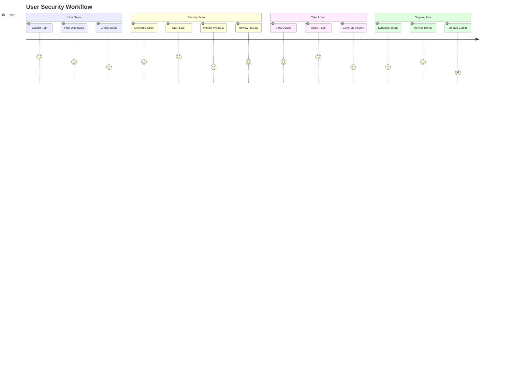
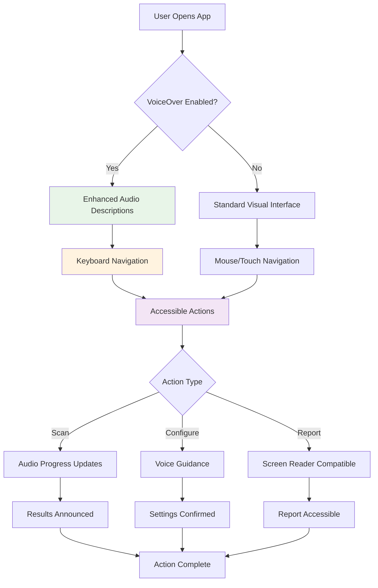
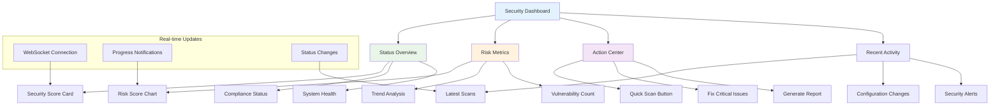

# UI/UX Design - Albator Swift Application

## 🎨 Design Philosophy

### Core Principles
- **Security-First Interface** - Clear security status communication
- **macOS Native Feel** - Follows Apple Human Interface Guidelines
- **Professional Appearance** - Enterprise-ready visual design
- **Information Hierarchy** - Prioritize critical security information
- **Accessibility** - VoiceOver and keyboard navigation support

### Visual Language
- **Clean and Minimal** - Reduce cognitive load
- **Status-Driven** - Use color and icons to convey security state
- **Data-Dense** - Efficient display of complex security information
- **Action-Oriented** - Clear paths to remediation

## 🏗️ Application Structure

### Information Architecture

```mermaid
graph TD
    A[Albator macOS App] --> B[Dashboard]
    A --> C[Security Modules]
    A --> D[Configuration]
    A --> E[Reports & Analytics]
    
    B --> B1[Security Status Overview]
    B --> B2[Risk Score Display]
    B --> B3[Recent Activity Feed]
    B --> B4[Quick Action Buttons]
    
    C --> C1[Network Scanner]
    C --> C2[Compliance Checker]
    C --> C3[Vulnerability Scanner]
    
    C1 --> C1a[Scan Configuration]
    C1 --> C1b[Real-time Results]
    C1 --> C1c[Service Details]
    
    C2 --> C2a[Framework Selection]
    C2 --> C2b[Check Results]
    C2 --> C2c[Remediation Guide]
    
    C3 --> C3a[Scan Options]
    C3 --> C3b[Vulnerability List]
    C3 --> C3c[Risk Assessment]
    
    D --> D1[Security Profiles]
    D --> D2[Application Settings]
    D --> D3[Custom Rules]
    
    E --> E1[Report Viewer]
    E --> E2[Historical Trends]
    E --> E3[Export Options]
    
    style B fill:#e3f2fd
    style C fill:#f3e5f5
    style D fill:#e8f5e8
    style E fill:#fff3e0
```



## 📱 Main Window Layout

### User Journey Flow



### Primary Window Structure

```swift
// Main window layout concept
struct MainWindowView: View {
    var body: some View {
        NavigationSplitView {
            // Sidebar (200-250pt width)
            SidebarView()
                .navigationSplitViewColumnWidth(min: 200, ideal: 250)
        } detail: {
            // Main content area
            ContentAreaView()
                .frame(minWidth: 800, minHeight: 600)
        }
        .toolbar {
            // Top toolbar with actions
            ToolbarView()
        }
    }
}
```

### Sidebar Navigation

**Visual Design:**
- Clean list-based navigation
- Section headers with icons
- Status indicators for each module
- Collapsible sections for organization

```
┌─ SECURITY ──────────────────┐
│ 🛡️  Dashboard              │
│ 🌐  Network Scanner    •    │
│ ✅  Compliance        ⚠️    │
│ 🔍  Vulnerabilities   🔴   │
├─ CONFIGURATION ────────────┤
│ ⚙️  Profiles               │
│ 🔧  Settings               │
│ 📝  Custom Rules           │
├─ REPORTS ──────────────────┤
│ 📊  View Reports           │
│ 📈  Analytics              │
│ 📤  Export                 │
└─────────────────────────────┘
```

## 🛡️ Security Dashboard

### Dashboard Layout

The main dashboard provides an at-a-glance view of system security status.

#### Status Overview Cards

```swift
// Dashboard card layout
LazyVGrid(columns: [
    GridItem(.flexible()),
    GridItem(.flexible())
], spacing: 20) {
    SecurityStatusCard()     // Overall security health
    RiskScoreCard()         // Numerical risk assessment
    ComplianceCard()        // Framework compliance status
    VulnerabilityCard()     // Critical vulnerabilities
    NetworkStatusCard()     // Network security status
    RecentActivityCard()    // Latest security events
}
```

#### Security Status Card Design

```
┌─ SECURITY STATUS ─────────────────────┐
│                                       │
│   🟢 SECURE                          │
│   Last scan: 2 hours ago             │
│                                       │
│   ✅ Firewall Active                 │
│   ✅ Encryption Enabled              │
│   ⚠️  3 Medium Issues                │
│                                       │
│   [View Details]                     │
└───────────────────────────────────────┘
```

#### Risk Score Visualization

```
┌─ RISK SCORE ──────────────────────────┐
│                                       │
│         ⚪⚪⚪🟡🔴                    │
│           25/100                      │
│                                       │
│   🟢 Low Risk                        │
│   Trending: ↗️ +5 since last week    │
│                                       │
│   [View Trends]                      │
└───────────────────────────────────────┘
```

### Interactive Elements

- **Status Indicators:** Traffic light system (🟢🟡🔴)
- **Progress Bars:** For ongoing scans and operations
- **Trend Arrows:** Show security posture changes
- **Quick Actions:** One-click remediation buttons

## 🌐 Network Scanner Interface

### Scan Configuration Panel

```
┌─ NETWORK SCAN CONFIGURATION ─────────┐
│                                       │
│ Target: [127.0.0.1        ] [Browse] │
│                                       │
│ Port Range: [1    ] to [1024     ]   │
│                                       │
│ Scan Type: ⚪ Quick  🔘 Full        │
│                                       │
│ Options:                              │
│ ☑️ Service Detection                 │
│ ☑️ Vulnerability Check              │
│ ☐ Aggressive Scan                   │
│                                       │
│ [Start Scan] [Save Template]         │
└───────────────────────────────────────┘
```

### Real-time Results Display

```
┌─ SCAN RESULTS ─────────────────────────────────────────────┐
│ Progress: ████████████████░░░░  80%  (812/1024 ports)     │
├────────────────────────────────────────────────────────────┤
│ Port  │ Protocol │ Service    │ Status │ Security         │
├────────────────────────────────────────────────────────────┤
│ 22    │ TCP      │ SSH        │ Open   │ 🟡 Needs Config │
│ 80    │ TCP      │ HTTP       │ Open   │ 🔴 Insecure     │
│ 443   │ TCP      │ HTTPS      │ Open   │ 🟢 Secure       │
│ 3389  │ TCP      │ RDP        │ Open   │ 🔴 High Risk    │
├────────────────────────────────────────────────────────────┤
│ Found: 12 open ports, 4 security issues                   │
└────────────────────────────────────────────────────────────┘
```

### Service Detail View

```
┌─ SERVICE DETAILS: SSH (Port 22) ──────────────────────────┐
│                                                            │
│ Status: 🟡 Needs Configuration                            │
│                                                            │
│ Details:                                                   │
│ • Protocol: SSH-2.0-OpenSSH_8.6                          │
│ • Authentication: Password enabled                        │
│ • Root login: Permitted                                   │
│                                                            │
│ Security Issues:                                           │
│ ⚠️ Password authentication enabled                        │
│ ⚠️ Root login permitted                                   │
│                                                            │
│ Recommendations:                                           │
│ • Disable password authentication                         │
│ • Use key-based authentication only                       │
│ • Disable root login                                      │
│                                                            │
│ [Apply Fix] [Learn More] [Ignore]                        │
└────────────────────────────────────────────────────────────┘
```

## ✅ Compliance Checker Interface

### Framework Selection

```
┌─ COMPLIANCE FRAMEWORKS ───────────────────────────────────┐
│                                                            │
│ Select frameworks to check against:                       │
│                                                            │
│ ☑️ NIST 800-53 Rev 5        Score: 85% (347/408 checks) │
│ ☑️ CIS macOS Benchmark      Score: 92% (156/170 checks) │
│ ☐ SOC 2 Type II           Score: --  (Not run)         │
│ ☐ Custom Framework        Score: --  (Not configured)  │
│                                                            │
│ Schedule:                                                  │
│ ⚪ Run once  🔘 Weekly  ⚪ Monthly                       │
│                                                            │
│ [Run Selected] [Configure] [Schedule]                     │
└────────────────────────────────────────────────────────────┘
```

### Compliance Results View

```
┌─ NIST 800-53 COMPLIANCE RESULTS ──────────────────────────┐
│                                                            │
│ Overall Score: 85% (347/408 checks passed)               │
│ ████████████████████░░░░                                  │
│                                                            │
│ By Category:                                               │
│ Access Control (AC):     🟢 95% (38/40)                  │
│ Audit & Accountability:  🟢 90% (18/20)                  │
│ System Communications:   🟡 75% (15/20)                  │
│ Configuration Mgmt:      🔴 65% (13/20)                  │
│                                                            │
│ Failed Checks: [View 61 issues]                          │
│ High Priority: [View 12 critical]                        │
│                                                            │
│ [Generate Report] [Remediate All] [Export]               │
└────────────────────────────────────────────────────────────┘
```

### Remediation Guide

```
┌─ REMEDIATION GUIDE ───────────────────────────────────────┐
│                                                            │
│ AC-3: Access Enforcement                                   │
│ Status: 🔴 Failed                                         │
│                                                            │
│ Issue: Guest account is enabled                           │
│                                                            │
│ Impact: Unauthorized users may gain system access         │
│                                                            │
│ Solution:                                                  │
│ Disable the guest account to prevent unauthorized access  │
│                                                            │
│ Command:                                                   │
│ sudo defaults write /Library/Preferences/com.apple.      │
│ loginwindow GuestEnabled -bool false                      │
│                                                            │
│ [Apply Fix] [Run Command] [Skip] [Learn More]            │
└────────────────────────────────────────────────────────────┘
```

## 🔍 Vulnerability Scanner Interface

### Vulnerability List View

```
┌─ VULNERABILITIES ──────────────────────────────────────────┐
│                                                            │
│ Filter: [All Severities ▼] [All Types ▼] [🔍 Search]     │
│                                                            │
│ Severity │ CVE ID        │ Component    │ CVSS │ Status   │
│──────────┼───────────────┼──────────────┼──────┼──────────│
│ 🚨 CRIT  │ CVE-2023-1234 │ macOS Kernel │ 9.8  │ Open     │
│ 🔴 HIGH  │ CVE-2023-5678 │ Safari       │ 8.1  │ Patched  │
│ 🟡 MED   │ CVE-2023-9012 │ SSH Config   │ 6.2  │ Open     │
│ 🟢 LOW   │ CVE-2023-3456 │ DNS Client   │ 3.1  │ Open     │
│                                                            │
│ Total: 47 vulnerabilities (5 critical, 12 high)          │
│                                                            │
│ [Scan for Updates] [Filter] [Export List]                │
└────────────────────────────────────────────────────────────┘
```

### Vulnerability Detail View

```
┌─ CVE-2023-1234: Kernel Privilege Escalation ─────────────┐
│                                                            │
│ Severity: 🚨 CRITICAL (CVSS 9.8)                         │
│ Status: Open (Patch Available)                           │
│                                                            │
│ Affected Component:                                        │
│ macOS Kernel (versions < 13.4)                           │
│                                                            │
│ Description:                                               │
│ A memory corruption vulnerability in the kernel allows    │
│ local attackers to escalate privileges to root level.    │
│                                                            │
│ Exploitation:                                              │
│ • Local access required                                   │
│ • No user interaction needed                              │
│ • Leads to complete system compromise                     │
│                                                            │
│ Remediation:                                               │
│ Update macOS to version 13.4 or later                    │
│                                                            │
│ [Update Now] [Schedule Update] [More Info]               │
└────────────────────────────────────────────────────────────┘
```

## ⚙️ Configuration & Settings

### Security Profile Editor

```
┌─ SECURITY PROFILE: Advanced ──────────────────────────────┐
│                                                            │
│ Profile Name: [Advanced Security      ]                   │
│ Description:  [Enhanced security for power users]         │
│                                                            │
│ Inherits from: [Basic ▼]                                 │
│                                                            │
│ ┌─ Firewall Settings ─────────────────────────────────────┐
│ │ ☑️ Enable Application Firewall                         │
│ │ ☑️ Stealth Mode                                        │
│ │ ☑️ Block All Incoming Connections                      │
│ │ ☑️ Enable Logging                                      │
│ └─────────────────────────────────────────────────────────┘
│                                                            │
│ ┌─ Privacy Settings ──────────────────────────────────────┐
│ │ ☑️ Disable Siri Analytics                              │
│ │ ☑️ Disable Crash Reporting                             │
│ │ ☑️ Disable Location Services                           │
│ │ ☐ Disable Handoff                                     │
│ └─────────────────────────────────────────────────────────┘
│                                                            │
│ [Save Profile] [Test Configuration] [Cancel]             │
└────────────────────────────────────────────────────────────┘
```

### Application Preferences

```
┌─ PREFERENCES ──────────────────────────────────────────────┐
│                                                            │
│ ┌─ General ────────────────────────────────────────────────┐
│ │ Launch at startup:        ☑️                           │
│ │ Check for updates:        🔘 Automatically             │
│ │ Default scan frequency:   [Weekly ▼]                   │
│ │ Theme:                   [System ▼]                    │
│ └──────────────────────────────────────────────────────────┘
│                                                            │
│ ┌─ Security ──────────────────────────────────────────────┐
│ │ Require authentication:   ☑️                           │
│ │ Auto-apply fixes:         ☐                            │
│ │ Backup before changes:    ☑️                           │
│ │ Enable audit logging:     ☑️                           │
│ └──────────────────────────────────────────────────────────┘
│                                                            │
│ ┌─ Notifications ─────────────────────────────────────────┐
│ │ Critical vulnerabilities: ☑️                           │
│ │ Compliance failures:      ☑️                           │
│ │ Scan completion:          ☐                            │
│ │ System changes:           ☑️                           │
│ └──────────────────────────────────────────────────────────┘
│                                                            │
│ [Apply] [Reset to Defaults] [Cancel]                     │
└────────────────────────────────────────────────────────────┘
```

## 📊 Reports & Analytics

### Report Viewer

```
┌─ SECURITY REPORTS ─────────────────────────────────────────┐
│                                                            │
│ Filter: [Last 30 days ▼] [All Types ▼] [🔍 Search]       │
│                                                            │
│ Date       │ Type        │ Score │ Issues │ Status        │
│────────────┼─────────────┼───────┼────────┼───────────────│
│ 2023-12-15 │ Full Scan   │ 85%   │ 12     │ Complete      │
│ 2023-12-14 │ Compliance  │ 92%   │ 8      │ Complete      │
│ 2023-12-13 │ Network     │ 78%   │ 15     │ Complete      │
│ 2023-12-12 │ Quick Scan  │ 88%   │ 6      │ Complete      │
│                                                            │
│ [View Report] [Export] [Schedule New] [Delete]           │
└────────────────────────────────────────────────────────────┘
```

### Trend Analysis

```
┌─ SECURITY TRENDS ──────────────────────────────────────────┐
│                                                            │
│ Risk Score Over Time                                       │
│ ┌─────────────────────────────────────────────────────────┐
│ │100├─────────────────────────────────────────────────────│
│ │ 90├─────────●───────────────●───────────────────────────│
│ │ 80├───────────────●─────────────●───────────────────────│
│ │ 70├─────●─────────────────────────────●─────────────────│
│ │ 60├───────────────────────────────────────────●─────────│
│ │ 50└─────────────────────────────────────────────────────│
│ │   Dec 1   Dec 8   Dec 15   Dec 22   Dec 29   Jan 5     │
│ └─────────────────────────────────────────────────────────┘
│                                                            │
│ Key Metrics:                                               │
│ • Average Score: 82%                                      │
│ • Best Score: 95% (Dec 8)                                │
│ • Trend: ↗️ +12% improvement                              │
│                                                            │
│ [Detailed View] [Export Chart] [Configure Alerts]        │
└────────────────────────────────────────────────────────────┘
```

## 🅰️ Accessibility User Flow



## 🎨 Visual Design System

### Color Palette

```swift
// Security status colors
extension Color {
    static let securityGreen = Color(red: 0.20, green: 0.78, blue: 0.35)    // Success
    static let securityYellow = Color(red: 1.00, green: 0.80, blue: 0.00)   // Warning
    static let securityRed = Color(red: 0.96, green: 0.26, blue: 0.21)      // Critical
    static let securityBlue = Color(red: 0.00, green: 0.48, blue: 1.00)     // Info
    static let securityGray = Color(red: 0.56, green: 0.56, blue: 0.58)     // Neutral
}

// System colors (adaptive)
extension Color {
    static let primaryBackground = Color(NSColor.controlBackgroundColor)
    static let secondaryBackground = Color(NSColor.windowBackgroundColor)
    static let primaryText = Color(NSColor.labelColor)
    static let secondaryText = Color(NSColor.secondaryLabelColor)
}
```

### Typography

```swift
// Typography scale
extension Font {
    static let largeTitle = Font.largeTitle.weight(.bold)         // 26pt
    static let title1 = Font.title.weight(.semibold)             // 22pt
    static let title2 = Font.title2.weight(.semibold)           // 17pt
    static let title3 = Font.title3.weight(.medium)             // 15pt
    static let headline = Font.headline.weight(.semibold)        // 13pt
    static let body = Font.body                                  // 13pt
    static let callout = Font.callout                           // 12pt
    static let subheadline = Font.subheadline                   // 11pt
    static let footnote = Font.footnote                         // 10pt
    static let caption = Font.caption                           // 10pt
    static let caption2 = Font.caption2                         // 9pt
}
```

### Icon System

```swift
// SF Symbols for consistent iconography
struct Icons {
    static let dashboard = "gauge"
    static let network = "network"
    static let compliance = "checkmark.shield"
    static let vulnerability = "exclamationmark.triangle"
    static let settings = "gearshape"
    static let reports = "chart.bar"
    static let secure = "checkmark.circle.fill"
    static let warning = "exclamationmark.triangle.fill"
    static let critical = "xmark.circle.fill"
    static let scan = "magnifyingglass"
    static let export = "square.and.arrow.up"
}
```

## 📊 Dashboard Component Hierarchy



## ♿ Accessibility Features

### VoiceOver Support

```swift
// Accessibility modifiers for VoiceOver
Text("Security Score: 85%")
    .accessibilityLabel("Security score is eighty-five percent")
    .accessibilityHint("Double tap for detailed breakdown")

Button("Start Scan") {
    startSecurityScan()
}
.accessibilityLabel("Start security scan")
.accessibilityHint("Begins comprehensive system security analysis")
```

### Keyboard Navigation

- **Tab order:** Logical progression through interface
- **Focus indicators:** Clear visual focus states
- **Keyboard shortcuts:** Common actions accessible via keyboard
- **Custom navigation:** Arrow keys for list navigation

### Dynamic Type Support

```swift
// Scalable text that responds to user preferences
Text("Security Status")
    .font(.headline)
    .dynamicTypeSize(.xSmall ... .accessibility5)
```

### Reduced Motion

```swift
// Respect user's motion preferences
@Environment(\.accessibilityReduceMotion) var reduceMotion

var animation: Animation? {
    reduceMotion ? nil : .easeInOut(duration: 0.3)
}
```

## 📱 Responsive Design

### Window Size Adaptations

```swift
// Adaptive layout based on window size
GeometryReader { geometry in
    if geometry.size.width > 1000 {
        // Wide layout: sidebar + main + detail
        ThreeColumnLayout()
    } else if geometry.size.width > 600 {
        // Medium layout: sidebar + main
        TwoColumnLayout()
    } else {
        // Narrow layout: navigation-based
        NavigationBasedLayout()
    }
}
```

### Content Scaling

- **Minimum window size:** 800×600 points
- **Optimal size:** 1200×800 points
- **Maximum practical size:** Adapts to display
- **Content scaling:** Maintains readability at all sizes

---

*This UI/UX design provides a professional, accessible, and user-friendly interface for the Albator security application while maintaining consistency with macOS design patterns.*